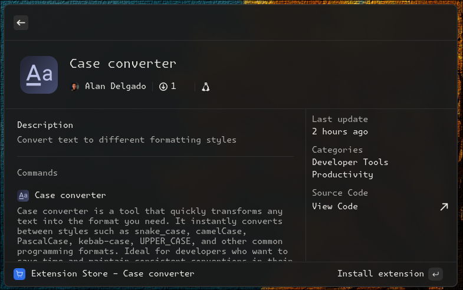

# Vicinae Extension Guidelines

This document describes the guidelines your extension must follow to be published in the official Vicinae store.

Submitting your extension to the Vicinae store means it will be downloadable by anyone using Vicinae. For this reason, we need to ensure your extension is safe for end users and will not harm their system in unexpected ways (other than user error).



## Requirements

### Validation

Your extension **must** pass the lint test, which validates the manifest and other critical aspects:

```bash
npx vici lint
```

Available since `@vicinae/api` v0.16.0.

### Directory Structure

Your extension must be placed in a directory named after the `name` field in your manifest.

Example: If `name` is `my-extension`, it should be located at `extensions/my-extension/`.

### Manifest Requirements

- At least one command - Extensions without commands cannot be used
- Set the `platforms` field to `["linux"]`
- The `title` field must be concise and clearly convey what your extension does
- Use the `categories` field to classify your extension (see [Categories](#categories) section below)
- Use `@vicinae/api` as a dependency.

- You should provide a concise and clear description for your extension and each of its commands.

### Icon Requirements

Your extension **must** have a valid icon.

The `icon` field in your manifest should map to an asset under the `assets` folder. If your icon is `extension_icon.png` we expect the icon to be at `assets/extension_icon.png`.

Commands can also specify their own icon if they need to, otherwise the extension icon is used for every command automatically.

Icons should have an aspect ratio of 1:1. The recommended size is 512x512 or higher.

You should probably use [ray.so/icon](https://ray.so/icon) to generate your icons.

## Quality Standards

### Error Handling

Your extension must provide good feedback when errors occur:

- **API call failures** - Display helpful error messages
- **Missing CLI tools** - Inform users which tools are required and how to install them
- **Unsupported environments** - Clearly indicate when the extension cannot run
- **No silent failures** - Users should understand why something doesn't work, not experience random crashes or unresponsive behavior

### Functionality

- Your extension should not implement something that is already handled by Vicinae natively

## Security Guidelines

### Binary Downloads

Your extension **must not** download random binaries from arbitrary websites under any circumstance.

**Exception:** You may download resources from a GitHub repository or other well known website **only if**:
- The repository is well-established and popular
- You do not have direct control over it
- You can justify the need during the review process

We may ask detailed questions about any external downloads during review.

If your extension needs the presence of a specific CLI tool in order to work, you should check for its presence on the system and show an error to the user prompting them to install the missing program on their own.

## Categories

Use the `categories` field in your manifest to indicate what type of extension you're building. Choose from the following available categories:

```json
[
  "Applications",
  "Communication",
  "Data",
  "Documentation",
  "Design Tools",
  "Developer Tools",
  "Finance",
  "Fun",
  "Media",
  "News",
  "Productivity",
  "Security",
  "System",
  "Web",
  "Other"
]
```

Select the category that best matches your extension's primary purpose.
