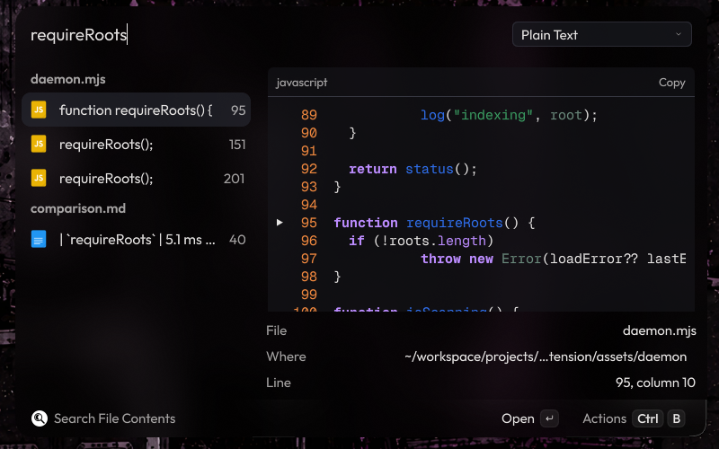
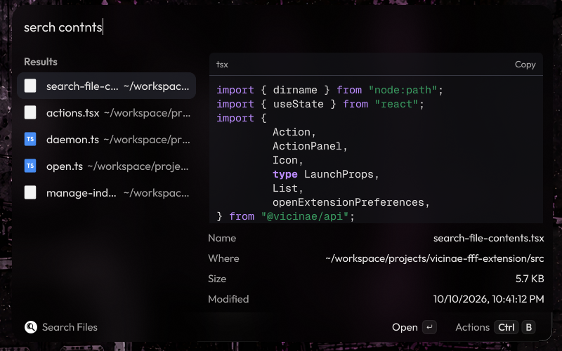

<p align="center">
  
</p>

<h1 align="center">BetterSearch for Vicinae</h1>

<p align="center">
  File name and file content search for <a href="https://vicinae.com">Vicinae</a>, powered by <a href="https://github.com/dmtrKovalenko/fff">fff</a>.<br>
  Typo-tolerant, frecency-ranked, git-aware, and fast enough to search on every keystroke.
</p>

---

<p align="center">
  
  
</p>

## Why BetterSearch

Vicinae's built-in file search matches file **names**. BetterSearch adds:

- **Search inside files.** Plain text, regex or fuzzy matching, with the surrounding lines previewed and one key to open your editor at the matching line.
- **Speed for content search.** About 5 ms per search on a warm index. A ripgrep search of the same home folder takes about 180 ms, and a launcher repeats it on every keystroke.
- **Focus on your own files.** `.gitignore` rules, hidden folders and dependency folders such as `node_modules` are skipped, so caches and app data do not crowd the results.
- **Git awareness.** Modified, untracked and staged files are tagged in the results.
- **Ranking that learns.** Recently modified files rank first, and files you open for a query rank higher the next time you type that query.
- **Typo tolerance in both commands.** `serch contnts` finds `search-file-contents.tsx`, and content search has a fuzzy mode for misspelled text.

See [docs/comparison.md](docs/comparison.md) for measurements and an honest comparison with the alternatives, including what BetterSearch does not do.

## Features

| Command | What it does |
| --- | --- |
| **Search Files** | Fuzzy search over file and folder names. An empty query lists recently modified files. Add `:42` to a query (`main.rs:42`) to open the editor at line 42. |
| **Search File Contents** | Searches inside text files. A dropdown switches between **Plain Text**, **Regex** and **Fuzzy** matching. Results are grouped by file. |
| **Manage File Index** | Shows the status of every indexed folder, and rescans, restarts or stops the background index. |

Both search commands have a preview panel. File search previews text with syntax highlighting, images, and folder listings. Content search shows the lines around each match, with the match marked.

### Query syntax

These work in both search commands, and come from fff's query language:

| Query | Meaning |
| --- | --- |
| `invoice 2024` | Fuzzy match on both words, in any order. |
| `*.ts useState` | Only `.ts` files. |
| `src/ TODO` | Only paths under a `src/` folder. |
| `report.md:120` | File search only: open the result at line 120. |

Content search is smart-case: an all-lowercase query ignores case, while a query with an uppercase letter matches case exactly.

### Actions

| Action | Shortcut |
| --- | --- |
| Open, or Open in Editor at Line for content matches | `Enter` |
| Open in Editor (when an editor is configured) | `Ctrl+E` |
| Open With… | Vicinae's Open With shortcut |
| Show in File Browser | `Ctrl+Shift+F` |
| Open Terminal Here | `Ctrl+Shift+T` |
| Copy Path | `Ctrl+Shift+C` |
| Copy Name | `Ctrl+Shift+N` |
| Copy Line (content matches) | `Ctrl+Shift+L` |
| Copy File | `Ctrl+Shift+.` |
| Toggle Preview | `Ctrl+Shift+P` |
| Rescan Index | Vicinae's Refresh shortcut |

## Requirements

- Vicinae 0.29 or newer.
- Node.js 18 or newer and npm, to build the extension. At runtime BetterSearch uses the Node runtime bundled with Vicinae.
- One of the platforms fff ships prebuilt binaries for:

| OS | Architectures |
| --- | --- |
| Linux (glibc or musl) | x64, arm64 |
| macOS | x64 (Intel), arm64 (Apple Silicon) |
| Windows | x64, arm64 |

## Install

```bash
git clone https://github.com/selfxplanatorium/bettersearch-vicinae
cd bettersearch-vicinae
npm install
npm run build
```

`npm install` also installs the background index's native library for your machine. `npm run build` places the extension in Vicinae's extension folder. Restart Vicinae (`vicinae server --replace`, or log out and back in) if the commands do not appear.

### One bundle for every platform

`npm run build:universal` includes the native library for all eight supported platforms in a single build of about 75 MB. Use it when the build is made on one machine and run on others, for example a shared Nix or dotfiles setup. Builds in CI (`CI=true`, as in the Vicinae store's pipeline) do this automatically, and `BETTERSEARCH_ALL_PLATFORMS=1` forces it. Every downloaded package is checked against the hashes in `assets/daemon/package-lock.json`.

## Configuration

Open Vicinae's settings, then **Extensions → BetterSearch**.

| Preference | Default | Notes |
| --- | --- | --- |
| Indexed Directories | `~` | Comma-separated, for example `~, /mnt/data/projects`. Each folder gets its own index. |
| Editor Command | empty | Opens files at a line. Placeholders: `{file}`, `{line}`, `{column}`. When empty, files open in their default application. |
| Run editor command in a terminal | off | For terminal editors such as Neovim or Helix. |
| Show preview panel | on | The starting state. `Ctrl+Shift+P` toggles it. |
| Follow symlinked directories | off | |

Editor command examples:

| Editor | Command | Terminal option |
| --- | --- | --- |
| VS Code | `code --goto {file}:{line}:{column}` | off |
| VSCodium | `codium --goto {file}:{line}:{column}` | off |
| Zed | `zed {file}:{line}:{column}` | off |
| Sublime Text | `subl {file}:{line}:{column}` | off |
| JetBrains IDEs | `idea --line {line} {file}` | off |
| Kate | `kate -l {line} -c {column} {file}` | off |
| Neovim | `nvim +{line} {file}` | on |
| Helix | `hx {file}:{line}:{column}` | on |
| micro | `micro +{line}:{column} {file}` | on |

### Searching from the main search bar

Vicinae does not let extensions add results to its main search bar. That bar only shows file results from Vicinae's own indexer, and only when `"search_files_in_root": true` is set in its config.

To use BetterSearch from the main bar, make it a **fallback command**. Fallbacks are offered when nothing else matches what you typed, and BetterSearch opens with your text already searched. Add its entrypoint ID to `fallbacks` in Vicinae's `settings.json`, or manage fallbacks from Vicinae's settings window:

```jsonc
"fallbacks": [
  "@selfxplanatorium/bettersearch:search-files",
  "files:search" // Vicinae's built-in file search, the default fallback
]
```

A global shortcut also works well. Bind `vicinae://launch/@selfxplanatorium/bettersearch/search-files` (or `search-file-contents`) in your desktop's shortcut settings.

## What gets indexed

fff decides what to index:

- **Inside git repositories**, `.gitignore` rules are respected.
- **Outside git repositories**, hidden files and folders are skipped, as are common dependency and cache folders: `node_modules`, `__pycache__`, `venv`, `.venv`, `target/debug`, `target/release`, `go/pkg/mod`, `.cargo/registry`, `.rustup/toolchains`, `.gradle/caches`, `.m2/repository`, `.npm/_cacache` and `.local/state`.
- **Content search** reads text files under 10 MB. Binary files, PDFs and office documents are listed in file search but not searched inside.

To include a hidden folder such as `~/.config`, add it to **Indexed Directories**.

## How it works

Vicinae runs each command in a short-lived worker, so an index built inside the command would be thrown away every time. BetterSearch instead starts a small background process on first use. It holds the fff index in memory, keeps it current with a file watcher, and answers the commands over a local socket (a named pipe on Windows).

The process exits on its own when Vicinae exits, when the extension is removed, or when you stop it from **Manage File Index**. It makes no network connections.

Details: [docs/architecture.md](docs/architecture.md).

## Data and privacy

Everything stays on your machine, in Vicinae's support folder for the extension (`~/.local/share/vicinae/support/bettersearch` on Linux):

- `db/`: search history used for ranking, one database per indexed folder.
- `daemon.log`: the background process's log.

Deleting the folder resets the ranking history.

## Uninstall

1. Remove the extension from Vicinae's settings, or delete its folder from Vicinae's extension directory (`~/.local/share/vicinae/extensions/bettersearch` on Linux).
2. Optionally delete the support folder listed above.

The background process notices that it was removed and exits within 10 seconds.

## Documentation

- [Comparison with the alternatives](docs/comparison.md)
- [Architecture](docs/architecture.md)
- [Troubleshooting](docs/troubleshooting.md)
- [Development](docs/development.md)

## Credits

- [fff](https://github.com/dmtrKovalenko/fff) by Dmitriy Kovalenko does all of the searching and indexing.
- [Vicinae](https://github.com/vicinaehq/vicinae) provides the launcher and the extension API.

## License

[MIT](LICENSE)
