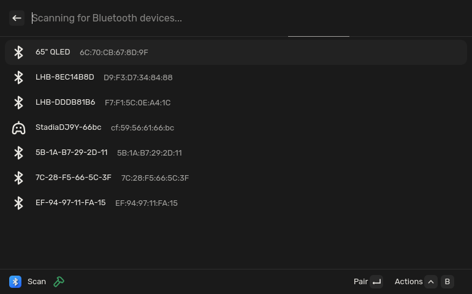
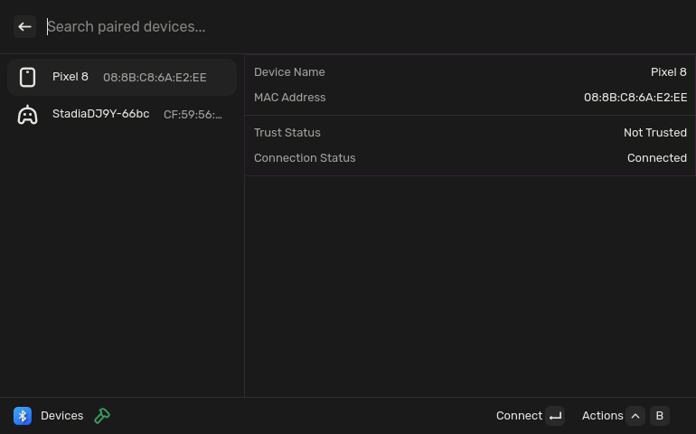

<p align="center">
    
</p>

# Vicinae-Bluetooth

This is a bluetooth extension for [Vicinae](https://github.com/vicinaehq/vicinae).

Vicinae-Bluetooth interacts with the Bluez daemon using bluetoothctl. So make sure that your linux distro is using Bluez.

<p align="center">Scan command:</p>
<p align="center">
    
</p>

<p align="center">Devices command:</p>
<p align="center">
    
</p>

## Installation

To install the project, you need to clone the repository, install the dependencies and run the build command. The extension will then automatically be put in the extension folder of vicinae

```bash
git clone https://github.com/gelei/vicinae-bluetooth.git
cd vicinae-bluetooth
npm install
npm run build
```

### Install dependencies

```bash
npm install
npm run dev
```
If you want to build the production bundle, simply run:

```bash
npm run build
```
