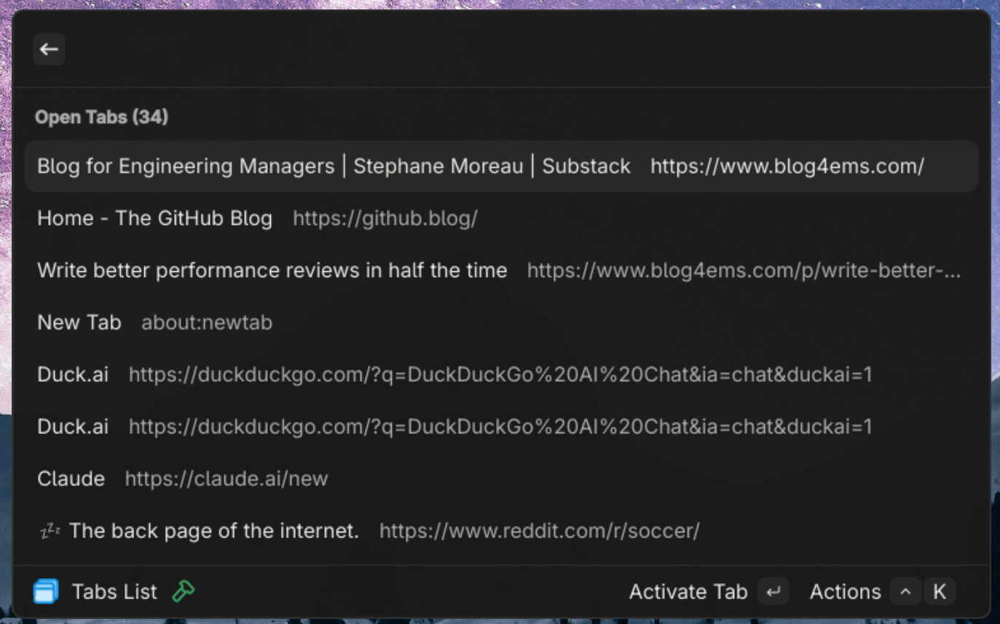

# Brotab

> A [Vicinae](https://github.com/vicinaehq/vicinae) extension to focus a browser tab using [brotab](https://github.com/balta2ar/brotab).

## Demo



## Features

- List all open browser tabs across all windows.
- Activate (focus) a specific tab and bring its window to the foreground.
- Close a tab.
- Copy the URL of a specific tab to the clipboard.

## Usage

## Pre-Requisites

This extension requires [brotab](https://github.com/balta2ar/brotab) command line tool to be installed as well the Brotab extension companion browser extension installed in the browser you want to control.

You can find installation instructions for brotab [here](https://github.com/balta2ar/brotab?tab=readme-overview#installation).

## Extension Preferences

Before using the extension, you should set the `brotabPath` in your extension preferences to point to the brotab executable on your system. The absolute path to should be used. (Ex: /home/<myuser>/.local/bin/brotab).

To find where your brotab executable is located, you can run the following command in your terminal:

```bash
which brotab
```

## Development


```bash
npm install
```

To run the extension in development mode, use:

```bash
npm run dev
```

To build the extension for production, use:

```bash
npm run build
```

## Acknowledgements

<a href="https://www.flaticon.com/free-icons/multiple-pages" title="multiple pages icons">Multiple pages icons created by FACH - Flaticon</a>
