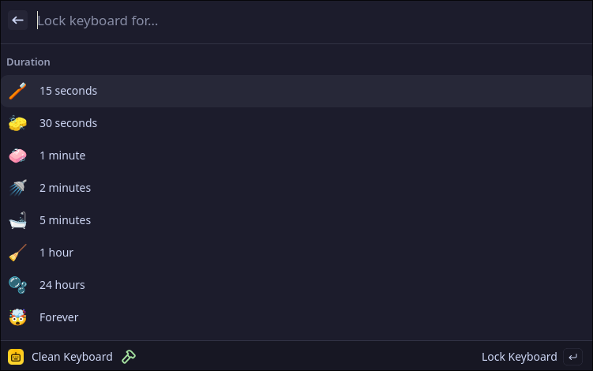
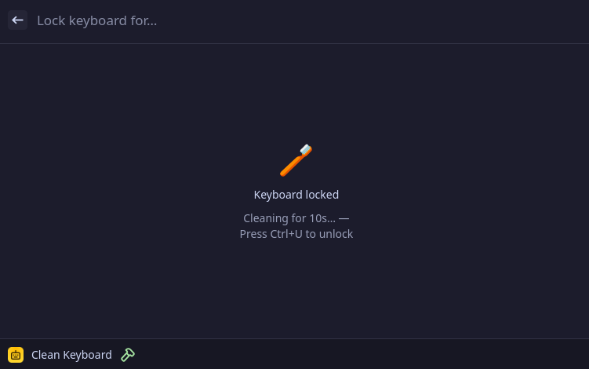

<p align="center">
    
</p>

# Clean Keyboard

Lock your keyboard to clean it without accidentally triggering keys. Press **Ctrl+U** at any time to unlock.

<p align="center">Duration picker:</p>
<p align="center">
    
</p>

<p align="center">Keyboard locked:</p>
<p align="center">
    
</p>

## Features

- Lock for a fixed duration (15s, 30s, 1m, 2m, 5m, 1h, 24h) or indefinitely
- Press **Ctrl+U** on the physical keyboard to unlock at any time
- Countdown timer shown in the UI while locked

## First-time setup

This extension reads directly from keyboard input devices. If you are not already in the `input` group, you will see an error on first use. Fix it with:

```bash
sudo usermod -aG input $USER
```

Then log out and back in. This is a one-time step.

> On many distros (Fedora, Ubuntu, Arch) the desktop user is already in the `input` group, so this may not be needed at all.

## Installation

Install directly from the Vicinae store, or manually:

```bash
git clone https://github.com/vicinaehq/extensions
cd extensions/clean-keyboard
npm install
npm run build
```

## Development

```bash
npm install
npm run dev
```
