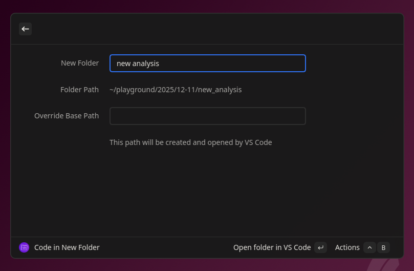

# Code in New Folder

A Vicinae extension that creates project folders and opens them in your preferred editor, terminal, or file browser.

## Features

- **Flexible folder structure**: `[BASE_PATH]/[YEAR]/[MM-DD]/[TITLE]` (year/date optional)
- **Path configuration**: Empty (home dir), `~/playground`, or absolute paths like `/projects`
- **Override base path**: Temporarily use a different location
- **Multiple editors**: VS Code, Cursor, Positron, VS Codium, or custom (vim, emacs, etc.)
- **Open modes**: Editor, terminal, or file browser
- **Optional features**: Open existing folders or open a specific file in folder

## Usage

1. Launch Vicinae and search for "Code in New Folder"
2. Enter your project title (optional: override base path or specify file to open)
3. Choose action: Open folder in editor (Enter), terminal, or file browser

## Configuration

Access settings via Open Vicinae Settings → Code in New Folder:

- **Preferred Editor**: VS Code, Cursor, Positron, VS Codium, or custom command (default: VS Code)
- **Custom Editor**: Custom command for other editors (vim, emacs, nano) (default: disabled)
- **Run in Terminal**: Optionally open custom editor inside terminal window (default: off)
- **Base Directory Path**: Empty (home), `~/path`, or absolute path (default: home)
- **Add Year/Month-Day**: Include date components in folder structure (default: enabled)
- **Sanitize Path Name**: Convert to camelCase, kebab-case, lowercase, snake_case (default: leave as is)
- **Truncate Path Name**: Limit to 50 chars or 10 words (default: enabled)
- **Open Existing Folders**: Reopen if folder exists (default: enabled)
- **Open Specific File**: Open a particular file in the new folder (default: disabled)

### Examples

**Path formats:**
- Empty: `~/2025/12-09/my_project`
- Relative to home: `~/playground/2025/12-09/my_project`
- Absolute: `/projects/2025/12-09/my_project`

**Folder structures:**
- Default: `[base]/2025/12-09/my_project`
- No year: `[base]/12-09/my_project`
- No dates: `[base]/my_project`

**Sanitization:**
- snake_case: `my_cool_project`
- none: `My Cool Project!`

## Requirements

- [Vicinae](https://docs.vicinae.com/) launcher
- Your preferred code editor installed and available in PATH (e.g., VS Code, Cursor, Positron, etc.)

## Inspiration

This extension is inspired by [Andrew Heiss's Raycast script](https://gist.github.com/andrewheiss/ef3ac7dfef2fdb8477a84e7e27f6853e) for creating dated project folders.
