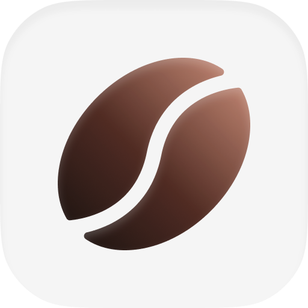
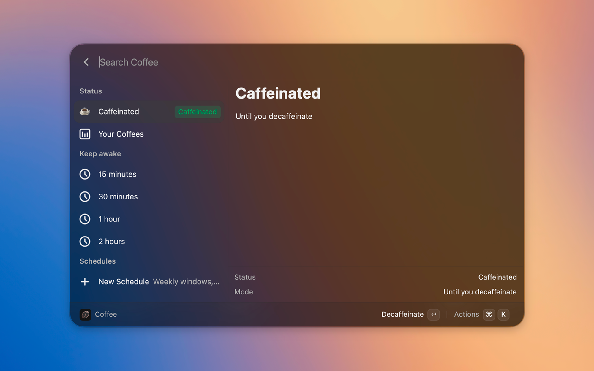

<p align="center">
  
</p>

# Coffee

[](LICENSE)

Keep your machine awake from the launcher — indefinitely, for a duration, until a time, while an app is running, or on a weekly schedule.

Coffee is a [Vicinae](https://vicinae.com) extension for Linux and macOS, inspired by the [Raycast Coffee extension](https://github.com/raycast/extensions/tree/00440c429c10952b393d21dfc56c4c23bab9e9a9/extensions/coffee/). Use the dashboard, or run a command to stay awake, stop, or toggle.

## Screenshots



[See more screenshots](./.github/assets/)

## Features

- Stay awake indefinitely, for a duration (`45m`, `1h30m`), until a time (`5pm`), or while an app is running
- Weekly schedules, including overnight ranges (`11:00`–`08:00`)
- Native inhibit: `caffeinate` on macOS, `systemd-inhibit` on Linux — the kernel drops the lock when time is up
- One dashboard for status, quick durations, and every schedule
- Manual decaf skips this occurrence; pause turns the schedule off until you resume it

## Getting started

1. Run **Coffee** for the dashboard: status, quick durations, and all schedules.
2. Or run **Caffeinate**, **Decaffeinate**, or **Toggle Caffeination** from root search.
3. Leave **Caffeination Status** enabled so weekly windows can start while Vicinae is running.

Times use a 24-hour clock. If start is later than end, the window runs overnight.

## Commands

- **Coffee** – Dashboard: status, quick durations, and schedules
- **Caffeinate** – Stay awake until you decaffeinate
- **Decaffeinate** – Allow sleep again
- **Toggle Caffeination** – Flip the current state
- **Caffeinate For** – Presets (15m–4h) or a duration argument
- **Caffeinate Until** – Argument like `5pm` / `17:30`, or a date picker
- **Caffeinate While** – Stay awake until the selected process exits
- **Schedule Caffeination** – Add, pause, and delete weekly windows
- **Caffeination Status** – HUD + subtitle; also the 1-minute schedule tick

## Preferences

- **Prevent display sleep** — idle inhibit / `caffeinate -d`
- **Prevent system sleep** — sleep inhibit / `caffeinate -i`
- **Prevent lid-close sleep (Linux)**
- **Prevent disk sleep (macOS)** — `caffeinate -m`

## Installation

Install and start [Vicinae](https://docs.vicinae.com/), then:

```bash
git clone https://github.com/tiagem/coffee-vicinae.git
cd coffee-vicinae
npm install
npm run build
```

Use `npm run dev` while Vicinae is running if you are working on the extension.

See the [Vicinae extension docs](https://docs.vicinae.com/extensions/create) for more detail.

## Contributing

Open an issue or a pull request.
