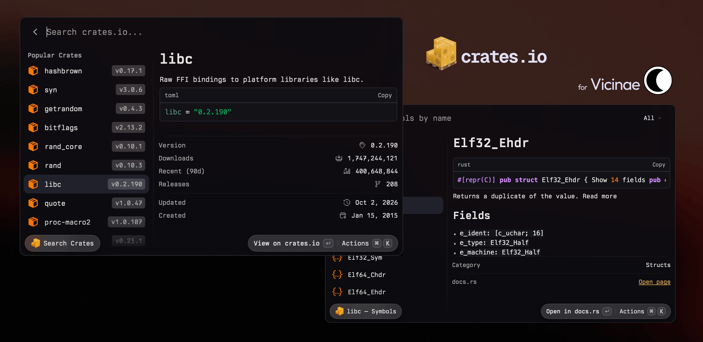

<div>
  <h2 align="center">crates.io Search</h2>
  <h4 align="center">for Vicinae and Raycast</h4>
  <br />
  <p align="center">
    <a href="https://vicinae.com"></a>
    <a href="LICENSE"></a>
    <br />
    <br />
    
  </p>
</div>

## Features

- Search across published crates.
- View crate details, including description, version, downloads, and more.
- View symbols and implementations for each crate.
- Copy dependency to your clipboard directly from the search results.
- Opens crate page, github repository, and documentation in your browser.

## Development

Requires Node >= 22:

```bash
vp install
vp run dev
vp run build # Vicinae bundle
```

Refer to the [docs](https://docs.vicinae.com/extensions/introduction) for more information.
