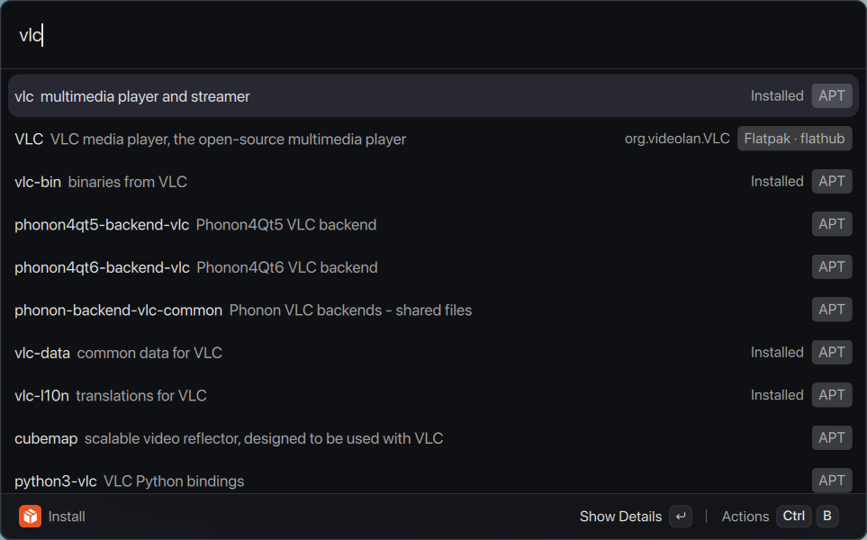
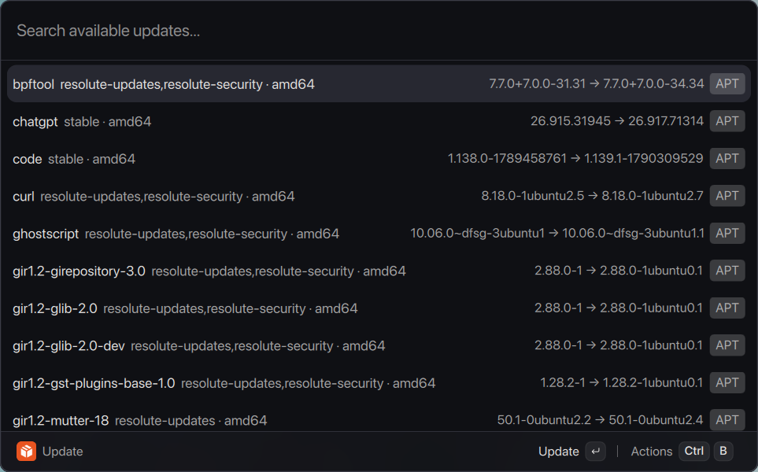

# Depot for Vicinae

Install, remove, and update APT and Flatpak applications without leaving
Vicinae.

**Depot: Install** → type `vlc` → choose APT or Flatpak → press Enter.



## Commands

- **Install** searches configured APT repositories and Flatpak remotes together.
- **Remove** lists installed desktop applications and confirms every removal.
- **Update** shows available updates and supports individual or Update All
  actions.

APT and Flatpak choices remain separate and clearly labeled. Results stay
keyboard-first, searchable, and native to Vicinae.



## Highlights

- Unified APT and Flatpak search
- Installed-state detection and package details
- Graphical Polkit authentication for APT operations
- User- or system-scoped Flatpak support
- Conservative APT removal safeguards
- No daemon, polling, background refresh, or private package index

## Requirements

- Vicinae 0.28.1
- Ubuntu or another Debian-based distribution using APT
- Polkit and `pkexec` for authenticated APT operations
- Flatpak with a configured remote, if Flatpak support is wanted

Flatpak is optional. Without it, Depot continues as an APT-only extension.
The current release candidate is validated on Ubuntu 26.04 amd64.

## Security

Depot uses only repositories and Flatpak remotes already configured on the
machine. It never adds repositories, imports keys, stores passwords, invokes a
shell, or performs package operations without an explicit user action.

See [SECURITY.md](SECURITY.md) for the security model and reporting guidance.

## Development

```bash
npm ci
npm test
npm run typecheck
npm run lint
npm run build
```

Use `npm run dev` while Vicinae is running for live extension development.

## Compatibility

Supported: Ubuntu and Debian-based systems using APT, with optional Flatpak.

Not supported: Snap, DNF, pacman/AUR, Nix, and Homebrew.

Known limitations:

- APT results use package metadata, so some names are less polished than a full
  software center.
- The first Flatpak search can be slower while the Flatpak CLI queries remotes.
- Packages requiring terminal-based configuration may not install successfully.
