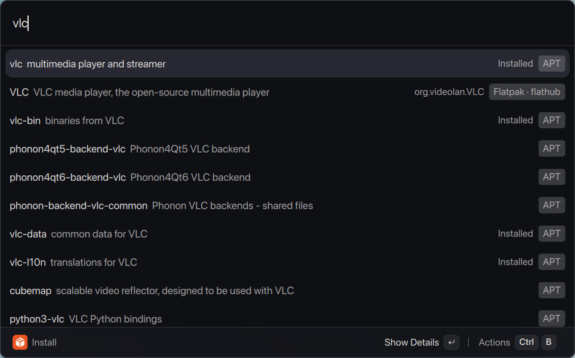
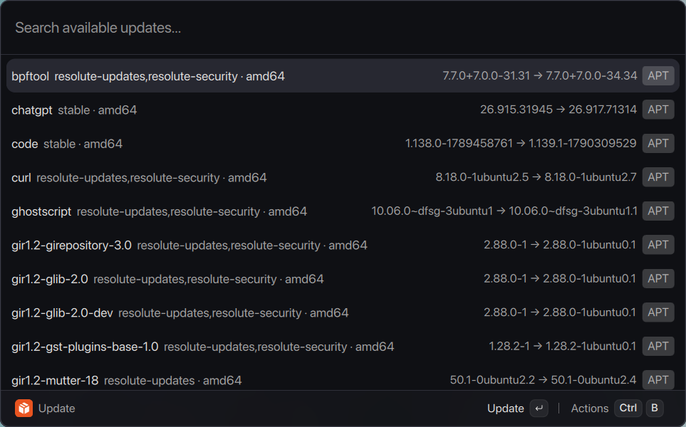

# Depot for Vicinae

Search, install, integrate, remove, and update Linux software without leaving
Vicinae.

**Depot Install** → type `vlc` → choose APT or Flatpak → press Enter.



## Commands

- **Depot Install** searches configured APT repositories and Flatpak remotes together.
- **Depot Install Local** searches local package files by name, then inspects and
  installs a selected `.deb`, `.flatpak`, `.flatpakref`, or AppImage file.
- **Depot Remove** lists installed desktop applications and confirms every removal.
- **Depot Update** shows available updates and supports individual or Update All
  actions.

APT and Flatpak choices remain separate and clearly labeled. Results stay
keyboard-first, searchable, and native to Vicinae.



## Highlights

- Unified APT and Flatpak search
- Friendly application names, summaries, and icons from local AppStream metadata
- Installed-state detection and package details
- Graphical Polkit authentication for APT operations
- User- or system-scoped Flatpak support
- Metadata review before any local package installation
- User-level AppImage integration under `~/Applications`
- Conservative APT removal safeguards
- No daemon, polling, background refresh, or private package index

## Requirements

- Vicinae 0.28.1
- Ubuntu or another Debian-based distribution using APT
- Polkit and `pkexec` for authenticated APT operations
- Flatpak with a configured remote, if Flatpak support is wanted
- `dpkg-deb` for local Debian package inspection
- `unsquashfs` for optional AppImage desktop metadata and icon extraction

Flatpak is optional. Without it, Depot continues as an APT-only extension.
AppStream enrichment is also optional; if local AppStream metadata or its CLI is
unavailable, Depot immediately falls back to package-manager results.
The current release candidate is validated on Ubuntu 26.04 amd64.

## Local packages

`Depot Install Local` opens with its search field focused. Type a package
filename and press Enter on the selected result, or paste an absolute path.
Search uses Vicinae's existing file index on demand and does not crawl the home
directory. Depot then determines the format without a manual format picker. A
filename extension is never enough to establish that a file is valid: Debian
archives are checked by `dpkg-deb`, Flatpak files are checked by Flatpak, and
AppImages must contain the expected ELF/AppImage and payload signatures.

- `.deb` metadata is shown before installation. Depot invokes APT through
  Polkit so APT can resolve dependencies; it does not use raw `dpkg -i` or
  disable package verification.
- `.flatpak` bundles are inspected in a disposable local repository, then
  installed in the configured user or system scope.
- `.flatpakref` files show their repository URL before confirmation. Installing
  one may add the remote declared by that reference using Flatpak's normal
  verification flow; Depot does not invent or discover other remotes.
- AppImages are statically inspected without executing the selected file.
  Depot copies an explicitly confirmed AppImage to `~/Applications`, marks the
  managed copy executable, creates a user desktop entry, uses an embedded PNG
  icon when safely available, and records only the files it created under its
  Vicinae support directory. It never launches a newly integrated AppImage.

AppImage integration is user-level and requires no root privileges. Existing
files are never overwritten: Depot selects a numbered filename when needed and
cleans up files it created if integration fails. Application settings and cache
directories are not touched.

Gear Lever 4.6.2 was evaluated during this milestone. Its documented Flatpak
CLI supports integration, listing, updating, and removal, but Depot uses its own
minimal integration path so the command remains functional without Gear Lever
and can track ownership of every file it creates. Depot does not read Gear
Lever's private state.

## Search and performance

Depot queries only enabled package managers after at least two characters are
entered. Search is debounced, bounded, and cancelled when the query changes or
the command closes. APT, Flatpak, and local AppStream metadata run independently,
so friendly names and icons can appear progressively without delaying raw search
results. Richer descriptions, categories, and license metadata are requested only
when a user opens an item's details.

AppStream uses the operating system's existing local metadata and cache. Depot
does not download a catalogue, build its own package database, run a daemon, or
perform work while Vicinae is idle.

## Security

Repository search uses only APT sources and Flatpak remotes already configured
on the machine. A user-selected `.flatpakref` is the sole local-file exception:
its declared remote is displayed before the user confirms installation. Depot
never discovers repositories, imports keys itself, stores passwords, invokes a
shell, or performs package operations without an explicit user action.

See [SECURITY.md](SECURITY.md) for the security model and reporting guidance.

## Development

```bash
npm ci
npm test
npm run typecheck
npm run lint
npm run build
```

Use `npm run dev` while Vicinae is running for live extension development.

## Compatibility

Supported: Ubuntu and Debian-based systems using APT, with optional Flatpak.

Not supported: Snap, DNF, pacman/AUR, Nix, and Homebrew.

Known limitations:

- APT results use package metadata, so some names are less polished than a full
  software center when AppStream has no matching application component.
- AppStream enrichment is best-effort and intentionally does not fetch remote
  icons or screenshots.
- The first Flatpak search can be slower while the Flatpak CLI queries remotes.
- Packages requiring terminal-based configuration may not install successfully.
- Type 1 AppImages can be validated and integrated, but embedded metadata
  extraction currently targets the modern Type 2 SquashFS format.
- Embedded AppImage icons are accepted only when they are bounded, valid PNG
  files. Other icon formats fall back to the desktop environment's default.
- AppImages integrated by Gear Lever or other tools are not yet included in
  Depot's Remove command; unified installed-software management is a later
  milestone.
