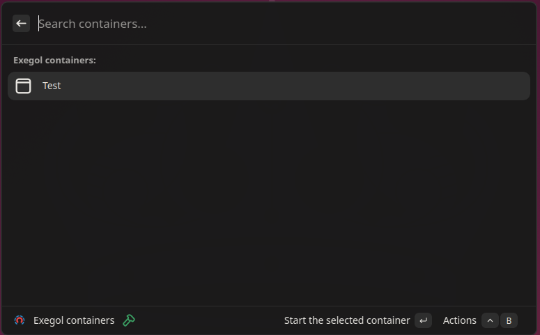
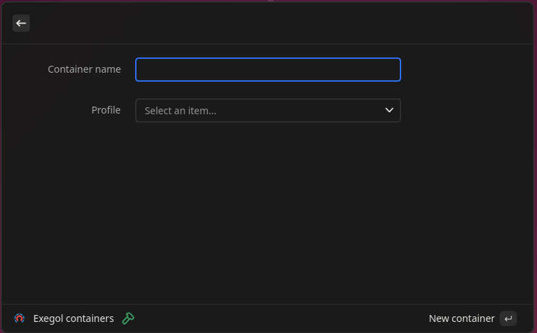
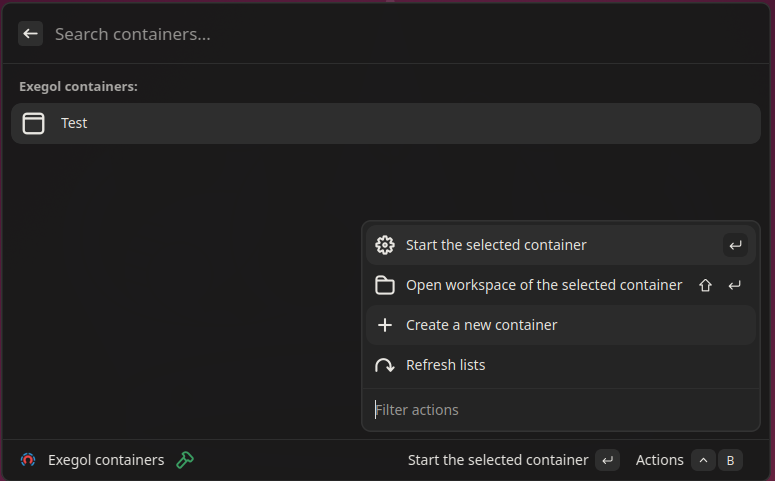

# Vicinae Extension

This extensions can be used to manage some aspects of Exegol containers.

## Features:
- Create a container based on a profile
- Open workspace folder
- Directly open a shell inside the container

## Screenshots






## Pre-requisites
- Docker
- Exegol, install it from: https://exegol.com/install

## Install
You can install the required dependencies and run your extension in development mode like so:

```bash
npm install
npm run dev
```
If you want to build the production bundle, simply run:

```bash
npm run build
```

## Profiles.json structure
The file should be placed here: `~/.exegol/profiles.json`.

```json
{
    "default":{
        "workspace_path":"",
        "cwd_mount":false,
        "update_fs":false,
        "volumes":"",
        "ports":"",
        "hostname":"",
        "privileged":false,
        "devices":"",
        "disable_X11":false,
        "disable_my_resources":false,
        "network":"",
        "disable_shared_timezones":false,
        "comment":"",
        "vpn":"",
        "vpn_auth":"",
        "desktop":false,
        "desktop_config":"",
        "log":false,
        "log_method":"",
        "log_compress":false,
        "env":"",
        "capability":"",
        "shell":"",
        "image":"free"
    }
}
```