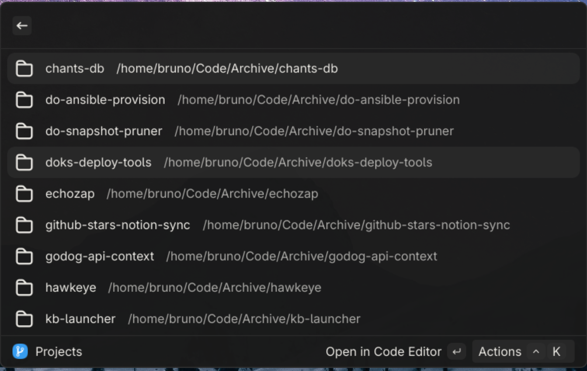

# Git Projects

> A [Vicinae](https://github.com/vicinaehq/vicinae) extension to manage local Git projects.

## Preview



## Features

- List all local Git projects found under a speciied root directory.
- Open projects in your preferred code editor, terminal or just in the file explorer.

## Usage

### Extension Preferences

Before using the extension, make sure to configure the following preferences:
- **Projects Root Directory**: The root directory where your local Git projects are located. The extension will scan this directory recursively to find Git repositories
- **Editor**: The command used to open your preferred code editor from the terminal.
- **Terminal**: The command used to open your preferred terminal emulator from the terminal (e.g., `gnome-terminal`, `kitty`, etc.).
- **Projects Scan Depth**: The maximum depth to scan for Git repositories under the root directory. (3 by default)

## Development

This extension uses [PNPM](https://pnpm.io/) as package manager. To install the required dependencies and run your extension in development mode, run:

```bash
pnpm install
```

To run the extension in development mode, use:

```bash
pnpm dev
```

To build the extension for production, use:

```bash
pnpm build
```

## Acknowledgements

<a href="https://www.flaticon.com/free-icons/ui" title="ui icons">Ui icons created by icon_small - Flaticon</a>