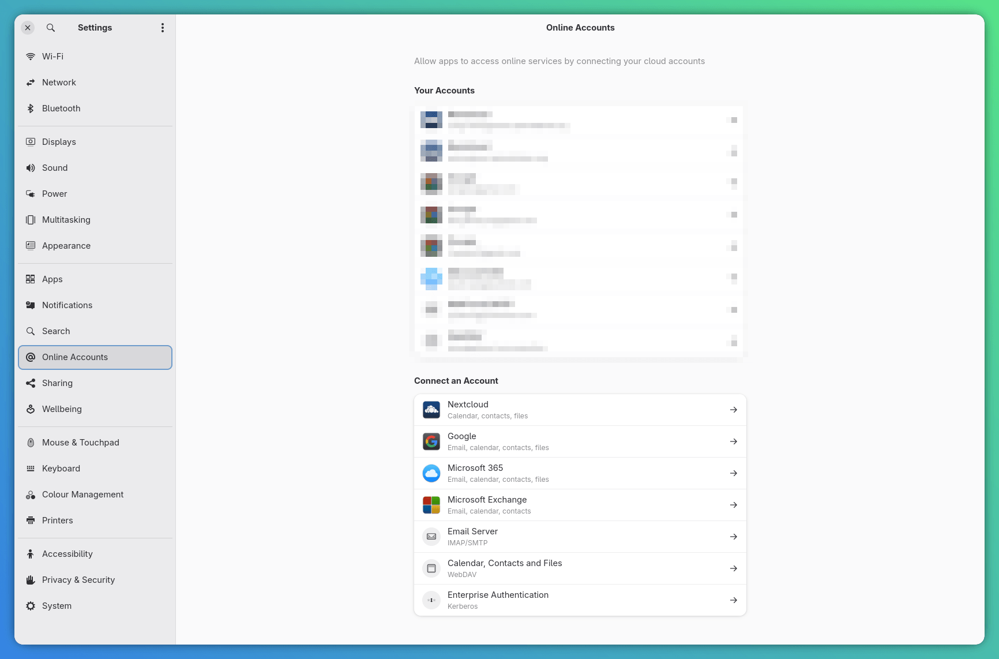

# GNOME Email

Browse email from mail-enabled [GNOME Online Accounts](https://help.gnome.org/users/gnome-help/stable/accounts.html) in Vicinae. The extension is read-oriented and opens IMAP mailboxes in read-only mode by default; optional write actions can be enabled explicitly in the extension settings. 

In non-read-only mode, the extension intentionally remains minimal, providing only read/unread toggling and Archive. Use a full email client for other operations.

The extension is privacy-first. -> Please, look at the "Privacy and data handling" section.

## Requirements

You have to set up at least one email address in [GNOME Online Accounts](https://help.gnome.org/users/gnome-help/stable/accounts.html)

### Technical requirements

- Linux with a running GNOME Online Accounts service (`goa-daemon`) in the user session.
- At least one account with **Mail** enabled in **GNOME Settings → Online Accounts**, exposing either IMAP settings or the Microsoft Graph provider.
- `which`, `xdg-mime`, `gtk-launch`, and the selected mail client's executable for external message opening.

Add or update accounts in **GNOME Settings → Online Accounts**. Accounts that do not expose usable IMAP settings or supported credentials are ignored or reported as unavailable.

## Features

- Discovers GOA mail accounts through IMAP or Microsoft Graph.
- Combines the latest 50 messages per account in **All Inboxes**, shown from cache immediately and refreshed in the background.
- Renders HTML messages and attachment metadata, with attachment-count badges in the list.
- Supports local filtering, server-side search, and mailbox reloads.
- Opens messages through tested Evolution and Thunderbird integrations, with a best-effort fallback for other clients.
- When write access is enabled, messages can be marked read/unread or moved to Archive.

### Local IMAP bridges

Custom GOA IMAP endpoints may include a port in the host field, such as `127.0.0.1:1144`. URI-form endpoints and bracketed IPv6 endpoints are also supported.

TLS certificates are verified by default, including on loopback. Enable **Allow Self-Signed Local IMAP TLS** only when a trusted local bridge such as Proton Mail Bridge uses a self-signed certificate. The exception can apply only to `localhost`, `127.*`, and `::1`; certificate verification is always enabled for remote IMAP servers.

## Featured functions' description

### Default view

Open the **Inbox** command in Vicinae. The initial view is **All Inboxes**. If a cached snapshot exists, it is rendered immediately while account discovery and message refresh continue in the background. Successful results replace the cache; if one account fails, its previous cached rows remain available. The combined dropdown beside the search field contains both the search scope and mailbox selection.

### Searching

- **Current List** is the default and instantly filters the latest 50 loaded messages without contacting the IMAP server again.
- **All Mail** performs a throttled, server-side IMAP or Microsoft Graph text search in the selected mailbox and returns up to the newest 100 matches. In **All Inboxes**, it searches every account's `INBOX`, merges successful results, and sorts them by date.

Clearing the search field restores the normal latest-message list. Remote search covers message text according to the provider's search implementation.

### Open in the default email client feature

In the email list, `Enter` opens the message detail and `Shift+Enter` opens it in the default email app using its `mid:` Message-ID.

**Evolution** and **Thunderbird** have tested integrations; Keep in mind: Evolution must already be open for reliable search! Other clients use an untested, best-effort fallback and may not support exact-message opening.

## Settings

### Read-Only Mode

Default: **enabled**

When enabled, mailboxes are opened read-only and actions that modify server state are hidden. Loading message lists and bodies does not add the IMAP `\Seen` flag.

When disabled, the extension may open mailboxes with write access and exposes the **Archive** and **Mark as Read / Mark as Unread** actions.

### Show Images

Default: **disabled**

When enabled, the detail view displays embedded images and permits remote images referenced by an email to load. Remote images can reveal that a message was opened, for example through tracking pixels.

When disabled, embedded and remote message images are not rendered. A centered **Image hidden** placeholder is displayed in their place, including alternative text when supplied by the message. Markdown image syntax and raw `` elements in externally controlled headers or plain-text bodies are also neutralized. The message detail action **Show Images for This Email Only** can explicitly reload one message with images without changing the global setting or affecting other messages.

### Show Account Favicons

Default: **disabled**

When enabled, the extension sends only the domain portion of each account address to Google's S2 favicon service and displays the compact `local-part @ favicon` account indicator. When disabled, no favicon request is made and the complete email address is displayed instead. A local provider-aware icon is used only as the fallback when an enabled favicon request fails.

### Allow Self-Signed Local IMAP TLS

Default: **disabled**

When enabled, untrusted TLS certificates are accepted only from loopback IMAP hosts. Enable this only for a trusted local bridge that requires it. It never disables certificate validation for a remote server.

### Maximum Message Processing Size

Default: **10 MiB**

Select a 2, 5, 10, or 25 MiB processing limit when a message detail is opened. For IMAP, it caps the complete raw MIME source—including text, HTML, embedded images, and attachments. For Microsoft Graph, it limits the body and extracted inline-image data retained for rendering after Graph has returned the response; it does not cap the network response size. Lower values reduce local memory and disk use; higher values improve rendering of long or attachment-heavy messages.

## Privacy and data handling

- Credentials are never persisted by the extension. They are requested from GNOME Online Accounts when an IMAP connection or Microsoft Graph request is made.
- The **All Inboxes** snapshot stores account configuration plus message subjects, senders, dates, read state, and attachment metadata in Vicinae's local, unencrypted `Cache`. Bodies and credentials are not included. The cache is limited to 5 MiB and remains subject to Vicinae's LRU eviction.
- Message bodies are fetched only when their detail view is opened.
- Remote message images are allowed only when **Show Images** is enabled. Disable it to reduce tracking and privacy risks.
- Extracted embedded images are stored under the extension support directory. Files older than seven days are removed the next time the command starts, and **Clear Message Image Cache** removes all extracted files immediately.
- Account-domain favicons are requested from Google's S2 favicon service only when **Show Account Favicons** is enabled. The request includes the domain portion of the account address, never the local part or complete address.
- No analytics or telemetry are collected by the extension.

## Error handling

Account failures are isolated where possible. In **All Inboxes**, messages from available accounts are still shown when another account fails, and the failed account is identified in the error message.

## Limitations

- The extension loads at most **the latest 50 messages** per selected mailbox or account inbox.
- Only **All Inboxes** is persisted. Individually selected mailbox lists and remote-search results are not cached.
- **Current List** search is limited to loaded messages; use **All Mail** for server-side search.
- Remote search behavior, text matching, character-set support, and performance depend on the IMAP server or Microsoft Graph.
- Message source downloads are capped at the configured size, so messages larger than that limit may be incomplete.
- Attachment count, filename, and MIME type metadata are displayed, but downloading arbitrary attachments is not supported.
- Composing, replying, forwarding, deleting, and creating or renaming mailboxes **are not supported**.
- Archive availability and behavior depend on the account's mail provider.
- GNOME Online Accounts providers that expose neither OAuth 2 nor password credentials are unsupported.
- External message opening has dedicated, tested paths only for Evolution and Thunderbird. Other email applications are untested and not guaranteed to support `mid:` links or exact-message navigation.
- Mail access was tested with Gmail and Proton Mail over IMAP, and with an Outlook.com GOA account over Microsoft Graph.

## Technical documentation

### GNOME Online Accounts and D-Bus

- [GNOME Online Accounts project and API documentation](https://gnome.pages.gitlab.gnome.org/gnome-online-accounts/)
- [GNOME help: Online Accounts](https://help.gnome.org/users/gnome-help/stable/accounts.html)
- [D-Bus specification](https://dbus.freedesktop.org/doc/dbus-specification.html)
- [`dbus-next` package](https://www.npmjs.com/package/dbus-next)

Account discovery uses `org.freedesktop.DBus.ObjectManager` on `org.gnome.OnlineAccounts`. Mail settings come from `org.gnome.OnlineAccounts.Mail`, while credentials come from `org.gnome.OnlineAccounts.OAuth2Based` or `org.gnome.OnlineAccounts.PasswordBased`.

### Microsoft Graph

- [Microsoft Graph Outlook mail overview](https://learn.microsoft.com/graph/api/resources/mail-api-overview)
- [List mail folders](https://learn.microsoft.com/graph/api/user-list-mailfolders)
- [List messages](https://learn.microsoft.com/graph/api/user-list-messages)
- [Get a message](https://learn.microsoft.com/graph/api/message-get)
- [Search messages](https://learn.microsoft.com/graph/search-concept-messages)
- [Update a message](https://learn.microsoft.com/graph/api/message-update)
- [Move a message](https://learn.microsoft.com/graph/api/message-move)

Microsoft 365 GOA accounts with provider type `ms_graph` use their GOA OAuth token directly with `graph.microsoft.com`. Graph folders, messages, search, body retrieval, read state, inline attachments, and Archive are kept in a backend-specific feature module and exposed to the UI through backend-neutral services.

### Desktop email integration

- [Evolution user documentation](https://help.gnome.org/users/evolution/stable/)
- [RFC 2392: `mid:` and `cid:` URL schemes](https://www.rfc-editor.org/rfc/rfc2392)
- [`xdg-mime` command documentation](https://portland.freedesktop.org/doc/xdg-mime.html)
- [`gtk-launch` manual](https://docs.gtk.org/gtk4/gtk-launch.html)

The extension identifies the default `mailto:` desktop entry with `xdg-mime`. Default Evolution is invoked directly with `mid:…`, and default Thunderbird uses `thunderbird -url mid:…`; these are the only tested integrations. Other clients use a best-effort `gtk-launch` fallback and are neither tested nor guaranteed to support exact-message opening. All process arguments are passed without a shell.

### Message rendering

- [Turndown repository and documentation](https://github.com/mixmark-io/turndown)
- [CommonMark specification](https://spec.commonmark.org/)

HTML message content is converted to Markdown because Vicinae's native `Detail` component renders Markdown rather than a browser DOM. Scripts, styles, document metadata, and other non-content elements are removed during conversion.
