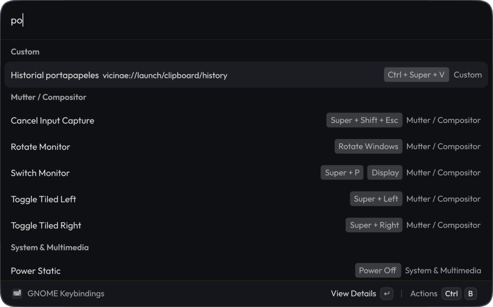

# GNOME Keybindings

Browse and search all GNOME keyboard shortcuts directly from Vicinae. Reads shortcuts automatically from system settings — no manual files to maintain.

<p align="center">
    
</p>

## Features

- **Search by anything** — filter by action name, key combination, command, or section
- **Native names** — shortcut names are read straight from GNOME's schema XML, so they match your system locale
- **Custom shortcuts** — shows your user-defined shortcuts alongside the built-in ones
- **Tag badges** — each key combination appears as a tag badge for quick visual scanning
- **Detail view** — view the full shortcut with its markdown cheatsheet per section
- **Copy actions** — copy the shortcut, action name, command, or the entire cheatsheet

## Requirements

- Linux with GNOME desktop environment
- `gsettings` available in the system path
- Vicinae launcher

## Installation

```bash
npm install
npm run build
```

After building, open Vicinae and search for "GNOME Keybindings".

## Usage

The extension displays all detected keyboard shortcuts grouped by section:

- **Windows** — window management (close, minimize, maximize, switch)
- **GNOME Shell** — overview, workspace navigation, screencasting
- **Mutter / Compositor** — compositor-level shortcuts
- **System & Multimedia** — volume, screenshots, media playback, lock screen
- **Custom** — your own user-defined shortcuts

Select any item to open the action panel, where you can view details or copy the shortcut, action, or command.

## Development

```bash
npm install
npm run dev      # development mode with hot reload
npm run build    # production build
npm run lint     # validate manifest
```

## How It Works

The extension reads keyboard shortcuts from GNOME schemas via `gsettings list-recursively`:

- `org.gnome.desktop.wm.keybindings`
- `org.gnome.shell.keybindings`
- `org.gnome.mutter.keybindings`
- `org.gnome.settings-daemon.plugins.media-keys`
- Custom keybindings

Action names are resolved from the `<summary>` tags in GNOME's schema XML files, so they're always in your system language.

## License

MIT
