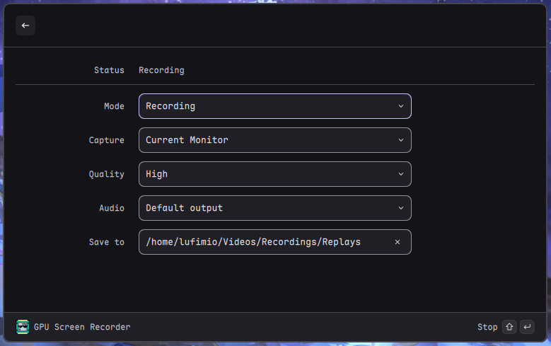
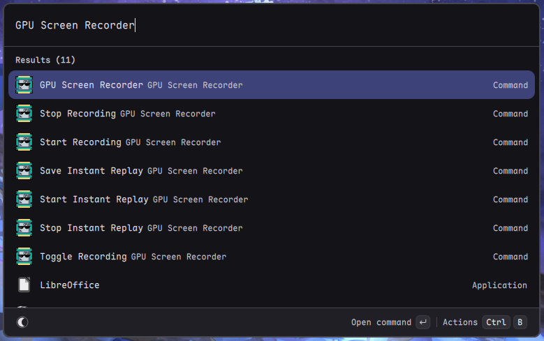

# GPU Screen Recorder
A Vicinae extension for controlling [GPU Screen Recorder](https://git.dec05eba.com/gpu-screen-recorder/)
## Features
- **Recording Modes**: Standard screen recording or instant replay (like NVIDIA ShadowPlay)
- **Multiple Capture Sources**: Current monitor, specific monitor selection, or window capture via Wayland portal
- **Quality Presets**: Medium, High, Very High, Ultra
- **Audio Sources**: Support for system audio and application audio (PipeWire required)
## Commands
### Main Control Panel
The main command provides a unified control panel with all settings.
### Commands
- **Start Recording** - Begin standard screen recording
- **Stop Recording** - Stop active recording and save
- **Toggle Recording** - Start/stop recording (mode-aware)
- **Start Instant Replay** - Begin instant replay buffer recording
- **Stop Instant Replay** - Stop instant replay mode
- **Save Instant Replay** - Save the current buffer to file (Ctrl+S when in instant replay)
## Screenshots
> 
> 

## Requirements
- [GPU Screen Recorder](https://git.dec05eba.com/gpu-screen-recorder/)
