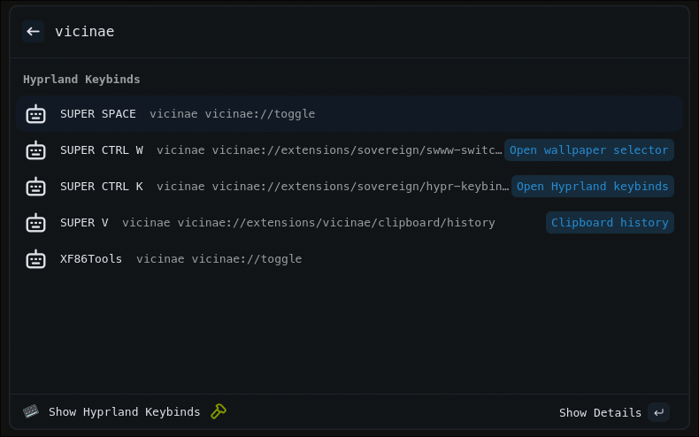

# Hyprland Keybinds (Vicinae Extension)

Look at what your binds are in a hyprland config file.



## Features

- Display all of your keybinds in a list with sweet detail!

## Requirements

- Linux with Hyprland
- [vicinae](https://github.com/vicinaehq/vicinae)

## Commands

- `Show Hyprland Keybinds` — List your hyprland keybinds.


## Commments

You can add comments to your keybinds config file to explain what each bind does. These comments will be displayed in the extension. ( See the blue text in the preview image at the top)

```
bind = SUPER, Q, killactive # Kill active window
```

## License

MIT
