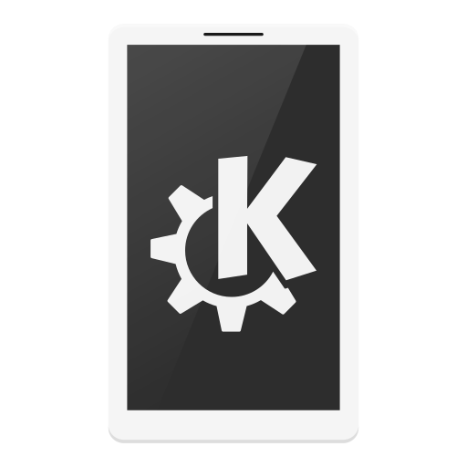

<p align="center">
  
</p>

<h1 align="center">KDE Connect</h1>

<p align="center">
  <b>A Vicinae launcher extension for seamless integration with KDE Connect on Linux.</b>
</p>

## Overview

This is an extension for the Vicinae launcher that provides quick and effortless device integration and sharing with your paired mobile devices and tablets.
Send files, share clipboard contents, ring your phone, compose SMS messages, and transfer text across one or multiple devices—all with a single keystroke directly from your launcher.

---

## Features

- **Send Files**: Pick and transfer single or multiple files with real-time progress feedback. Choose an individual target or send to both/all connected devices at once.
- **Send Text**: Quick search-bar input—type `send text`, press <kbd>Tab</kbd>, enter your text/link, and hit <kbd>Enter</kbd>.
- **Send Clipboard**: Instantly push your system clipboard to your phone or tablet with a single keystroke.
- **Send SMS (Message)**: Compose and send text messages directly through your connected phone without picking it up.
- **Ring Phone**: Trigger a loud ring on your phone to locate it in seconds.
- **Intelligent Multi-Device Support**: Zero friction when 1 device is connected; interactive device pickers and broadcast options when multiple devices are online.

---

## Commands Overview

| Command            | Description                                                                                            |
| :----------------- | :----------------------------------------------------------------------------------------------------- |
| **Send File**      | Open file selector dialog, pick one or multiple files, and transfer to single or both/all devices.     |
| **Send Text**      | Inline launcher argument: press <kbd>Tab</kbd> $\rightarrow$ type text $\rightarrow$ <kbd>Enter</kbd>. |
| **Send Clipboard** | Instantly sync and push your system clipboard buffer to connected devices.                             |
| **Ring Phone**     | Ring your phone at full volume to quickly locate it.                                                   |
| **Send Message**   | Form view to compose and send SMS text messages through your connected phone.                          |

---

## Multi-Device Support

This extension provides seamless multi-device handling whether you have one phone or multiple connected devices:

- **Single Device Active (Zero Extra Clicks)**:
  When only 1 device is reachable (e.g. `Pixel Phone`), commands like **Ring Phone**, **Send Clipboard**, and **Send Text** execute immediately and close the launcher with zero prompts. In **Send File** and **Send Message**, that device is automatically pre-selected.

- **Multiple Devices Active**:
  - **Interactive Action Picker (`Ring Phone`, `Send Text`, `Send Clipboard`)**: Displays a clean, keyboard-navigable list to target an individual device or broadcast to **All Devices**:
    ```
    Select device...
    📱 Pixel Phone       (Press Enter to select)
    📱 Samsung Phone     (Press Enter to select)
    🌐 All Devices       (Press Enter to send/ring all)
    ```
  - **Both / All Devices File Transfer (`Send File`)**: The dropdown includes **Both Devices** (or **All Connected Devices**), which transfers files sequentially to each device with live per-device progress:
    ```
    Sending (1/2) to Pixel Phone: photo.png
    Sending (1/2) to Samsung Phone: photo.png
    ```
  - **Target Device Dropdown (`Send Message`)**: Choose which phone should dispatch your SMS.

- **Strict Reachability Filtering**:
  Only devices confirmed to be both **paired and currently reachable** on your local network (`kdeconnect-cli -a`) are displayed. Offline or paired-only devices are excluded to ensure 100% reliable delivery.

---

## Prerequisites

1. **KDE Connect** must be installed and running on both your computer and your phone/tablet.
   - **Arch Linux / Manjaro:**
     ```bash
     sudo pacman -S kdeconnect
     ```
   - **Debian / Ubuntu **
     ```bash
     sudo apt install kdeconnect
     ```
   - **Fedora:**
     ```bash
     sudo dnf install kde-connect
     ```
2. **KDE Connect CLI (`kdeconnect-cli`)** must be accessible in your system `PATH`.
3. Your computer and phone must be **paired** and connected to the same local Wi-Fi network.

You can verify your connection status in terminal at any time:

```bash
kdeconnect-cli -a
```

---

## Development

### Prerequisites

- Node.js
- npm, pnpm, or bun
- Vicinae

### Setup & Build

```bash
# Install dependencies
npm install

# Run in development mode (live reload in Vicinae)
npm run dev

# Format and lint
npm run format
npm run lint

# Build for production
npm run build
```

---

## Credits & Acknowledgements

- **[Vicinae](https://www.vicinae.com/)** — A focused Application Launcher for your Desktop.
- **[KDE Connect](https://kdeconnect.kde.org/)** — Seamless wireless integration between desktop and mobile devices.
