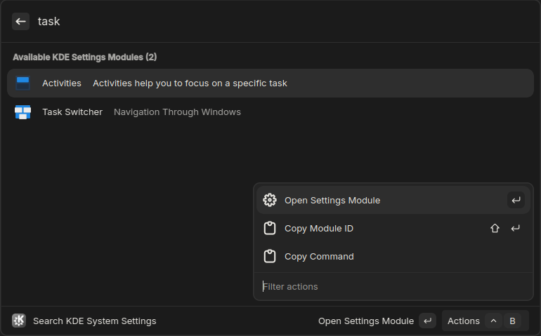

# KDE System Settings

Search and open KDE System Settings modules directly from Vicinae.

## Features

- Automatically discovers all available KDE settings modules on your system
- Supports both KDE5 and KDE6 (legacy KDE5 modules can be enabled in preferences)
- Search by module name, description, or keywords
- Copy module IDs or full commands to clipboard
- Can be enabled as a fallback command for root search

## Usage

1. Search for "KDE settings" or "search system settings" in Vicinae to browse or search for all available KDE settings modules.
2. Press Enter or click to open the module
3. Use copy actions to get module IDs or commands



### Enable as root fallback command

1. Search for "Configure Fallback Commands" in Vicinae
2. Enable "Search KDE System Settings"
3. The option to use the root search query as the search input for KDE settings modules will now appear in the root search results

## Development

```bash
bun install
bun run build
bun run dev
```
