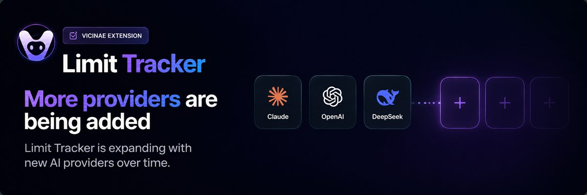
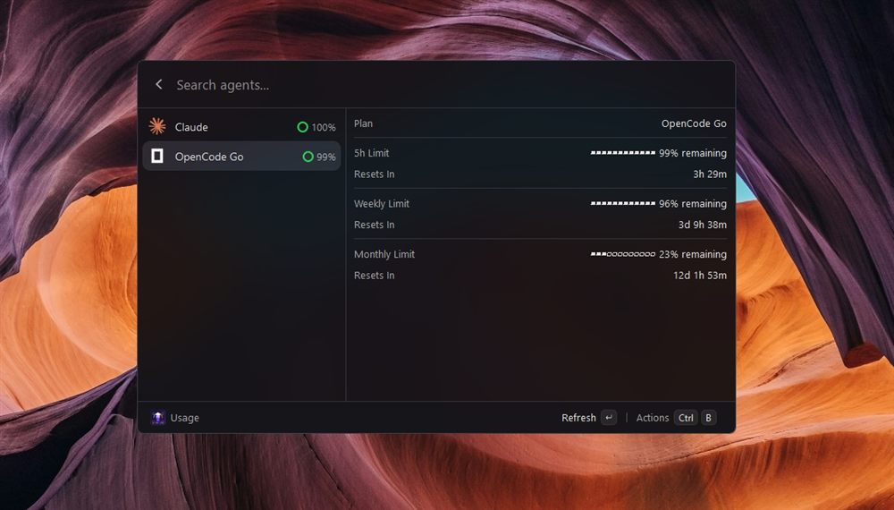

# Limit Tracker

> Track AI coding agent limits across **Claude, Codex, Copilot, Cursor, DeepSeek, Devin, Gemini, OpenCode Go, z.ai, Antigravity, Command Code, Kimi, Synthetic, ClinePass, Droid, MiniMax, Grok, Amp and AiHubMix** — directly from [Vicinae](https://vicinae.com).

Limit Tracker is a **native Vicinae extension** (built with `@vicinae/api`, TypeScript and React). It shows each provider's plan, 5-hour and weekly limits, a live countdown to reset, per-model Claude windows, and the Codex manual-reset credit bank — in a clean master-detail list.

---

## Preview


*Screenshot: OpenCode Go detail with standardized 5h/Weekly/Monthly limits and live Resets In — same layout as Claude/Codex.*

---

## Why

- **Plan around resets.** Per-provider 5-hour and weekly windows with live countdowns to the next reset — stop guessing whether to start that long task.
- **See everything at a glance.** Plan, limits, reset time, per-model Claude windows, and Codex reset credits — all in one place.
- **Privacy-first.** Reuses existing provider sessions — OAuth, API keys, browser cookies, local files — instead of asking for passwords. Tokens for manually added accounts stay in the extension's local storage.
- **Lightweight.** Native Vicinae extension, no background processes, minimal UI.

---

## Install

### Requirements
- [Vicinae](https://vicinae.com) installed (v0.27.1+).
- [Node.js](https://nodejs.org) (the app embeds its own Node runtime; the CLI uses your system Node).
- The `vici` CLI, which ships with `@vicinae/api`.

### Validate and build
```bash
# 1. install dependencies
npm ci

# 2. type-check (test suite files are kept local-only, not committed)
npm run typecheck      # tsc --noEmit

# 3. build in .build/limit-tracker without changing the installed extension
npm run build
```

The bundle is in `.build/limit-tracker`. `npm run install:local` builds into the
Vicinae CLI's extension directory and replaces the existing installation there.
Back up that installation before updating. Then open Vicinae and search for **"Usage"**.

On Windows, still in alpha, `vici` writes the bundle to `%APPDATA%\vicinae\extensions`
while the app can load from `%LOCALAPPDATA%\vicinae\data\extensions`.
Confirm the extension directory used by your installed version before copying the
bundle; preserve the existing `limit-tracker` directory as a backup. The ordinary
build command does not copy into either profile directory.

The HTTP timeout covers both response headers and the JSON body. The local
`npm test` suite (`*.test.ts` files, fetcher mock-server tests, manifest
consistency checks) is maintained in the working copy but not committed to the
repository.

### Development
```bash
npm run dev            # vici develop (watch mode)
```

---

## Providers

- **Claude** — OAuth API; 5-hour, weekly, and per-model (Sonnet, Opus, etc.) limits with individual reset timers.
- **Codex** — OAuth API; 5-hour, weekly, code review limits, credits, and manual-reset credit bank.
- **Copilot** — Reads an existing GitHub token from your environment or extension preferences and queries the internal usage API.
- **Cursor** — Browser session cookies for plan + usage + billing resets.
- **DeepSeek** — API key for credit balance tracking.
- **Devin** — Two paths: a **self-serve** session token + organization (`app.devin.ai/api/<org>/billing/quota/usage`) reporting daily + weekly quota on any plan, and an **Enterprise** `cog_` service-user key (`DEVIN_API_KEY`) for ACU limits per billing cycle.
- **Gemini** — OAuth-backed quota API using Gemini CLI credentials.
- **OpenCode Go** — Usage API for subscription tracking.
- **z.ai** — API token for personal/team quota, 5-hour, and hourly usage windows.
- **Antigravity** — Quota snapshots per model pool (Google/Anthropic/OpenAI), via omp.
- **Command Code** — Credit usage (plan, percent used, renewal) via `~/.commandcode/auth.json`.
- **Kimi** — Kimi Code API key (`KIMI_CODE_API_KEY` or CLI login at `~/.kimi-code/credentials/`) for the weekly quota + 5-hour rate window.
- **Synthetic** — API key (`dev.synthetic.new`) for the 5-hour, weekly-token, and search-hourly quota lanes.
- **ClinePass** — API key (`cline.bot`) for 5-hour, weekly, and monthly limits.
- **Droid (Factory)** — Factory API key (`app.factory.ai/settings/api-keys`, `FACTORY_API_KEY`, or `~/.factory/.env`) for 5-hour/weekly/monthly token limits.
- **MiniMax** — Coding Plan key (`platform.minimax.io`) for per-model 5-hour + weekly quotas.
- **MiniMax CN** — Coding Plan key (`platform.minimaxi.com`) for the China-mainland endpoint.
- **Grok** — Grok CLI OAuth token (`~/.grok/auth.json` or `GROK_OAUTH_TOKEN`) for the credit usage percent + period reset.
- **Amp** — Access token (`AMP_API_KEY`) or local `amp usage` CLI output for free-tier, subscription, and credit balances.
- **AiHubMix** — API key (`aihubmix.com`) for the account balance (`/dashboard/billing/remain`).
- **oh-my-pi harness (fallback)** — `omp auth-broker login` credentials are reused automatically
  when the native login is missing (Claude, Codex, OpenCode Go, Antigravity);
  omp-sourced values are labeled `via omp` in the provider's own row, never as
  their own row. Tokens are used as-is and never written anywhere.

---

## Features

- **Master-detail UI:** a clean agent list on the left, with a detail panel on the right showing plan, limits and reset time.
- **Live reset countdown:** "Resets In" ticks down in real time (days / hours / minutes — no seconds), for both Claude and Codex.
- **5-hour & weekly limits:** percentage remaining with a progress bar, per provider.
- **Standard limit rows:** every provider renders the same row — title, ASCII bar, percent remaining, and reset. When a provider has more than 3 limit windows (e.g. Antigravity pools), the detail switches to compact one-line rows with the reset countdown inline.
- **Claude per-model windows:** each `seven_day_*` / `weekly_scoped` model (e.g. Sonnet) shown as its own section with its own reset timer.
- **Codex reset-credit bank:** "Limit Reset Credits" (manual resets available) with expiry, when present.
- **Progress rings:** each list row shows a circular usage ring.
- **Toggle providers:** enable/disable any provider from the extension preferences (Settings → Limit Tracker).
- **Menu-bar mode:** a second command shows the same data in the menu bar and refreshes hourly.
- **Smart refresh:** debounce + cooldown to prevent rate limits (429 errors).
- **Instant open (stale-while-revalidate):** the last cached payload renders immediately on launch — no loading spinners for previously fetched providers — while a background refresh revalidates auth and TTL. The "Updated HH:MM" stamp always reflects the real fetch time.
- **Configurable cache:** TTL for remote API requests (default 180s; 0 disables caching).

---

## Preferences

Open **Vicinae Settings → Limit Tracker** (or press <kbd>⌘</kbd>/<kbd>Ctrl</kbd>+<kbd>,</kbd> inside the command):

| Preference | Type | Description |
| --- | --- | --- |
| Show Claude | checkbox | Show Claude usage in the list |
| Claude Limit View | dropdown | Which Claude limit the list row and menu bar show (Auto, 5-hour, Weekly) |
| Show Codex | checkbox | Show Codex usage in the list |
| Codex Limit View | dropdown | Which Codex limit the list row and menu bar show (Auto, 5-hour, Weekly) |
| Show Copilot | checkbox | Show Copilot usage in the list |
| Show Cursor | checkbox | Show Cursor usage in the list |
| Show DeepSeek | checkbox | Show DeepSeek balance in the list |
| Show Devin | checkbox | Show Devin quota/ACU limits in the list |
| Show Gemini | checkbox | Show Gemini usage in the list |
| Show OpenCode Go | checkbox | Show OpenCode Go subscription in the list |
| Show z.ai | checkbox | Show z.ai (GLM) usage in the list |
| Show Antigravity | checkbox | Show Antigravity quota snapshots (via omp) in the list |
| Show Command Code | checkbox | Show Command Code credit usage in the list |
| Additional Codex Homes | textfield | Comma-separated `CODEX_HOME` dirs beyond the default |
| Copilot Authorization Token | password | Optional fallback OAuth token (auto-detected from `GH_TOKEN`/`GITHUB_TOKEN`) |
| Cursor Cookie Header | password | Optional fallback Cookie header (auto-detected from Cursor login) |
| DeepSeek API Key | password | Optional API key (auto-detected from OpenCode / `DEEPSEEK_API_KEY`) |
| Devin Session Token | password | `app.devin.ai` session token for daily/weekly quota on any plan (or `DEVIN_BEARER_TOKEN`) |
| Devin Organization | textfield | Org slug or `org_...` id — required with the session token (or `DEVIN_ORGANIZATION`) |
| Devin API Key | password | Service user key `cog_...` with `ViewAccountConsumption` + `ManageBilling` (Enterprise only, or `DEVIN_API_KEY`) |
| OpenCode Go API Key | password | Your OpenCode Go API key |
| OpenCode Go Workspace ID | textfield | Cookie-login workspace id (used with the auth cookie, instead of an API key) |
| OpenCode Go Auth Cookie | password | `opencode.ai` session cookie (only with Workspace ID above) |
| z.ai API Token | password | Optional token (auto-detected from `ZAI_API_KEY`/`GLM_API_KEY`) |
| Command Code API Key | password | Optional key (auto-detected from `~/.commandcode/auth.json` or `COMMANDCODE_API_KEY`) |
| Show Kimi | checkbox | Show Kimi Code quotas in the list (off by default) |
| Kimi Code API Key | password | Optional key (auto-detected from the Kimi Code CLI or `KIMI_CODE_API_KEY`) |
| Show Synthetic | checkbox | Show Synthetic quotas in the list (off by default) |
| Synthetic API Key | password | API key from `dev.synthetic.new` (or `SYNTHETIC_API_KEY`) |
| Show ClinePass | checkbox | Show ClinePass limits in the list (off by default) |
| ClinePass API Key | password | API key from the Cline app (or `CLINEPASS_API_KEY`/`CLINE_API_KEY`) |
| Show Droid | checkbox | Show Factory Droid limits in the list (off by default) |
| Factory API Key | password | Key from `app.factory.ai/settings/api-keys` (or `FACTORY_API_KEY`/`~/.factory/.env`) |
| Show MiniMax | checkbox | Show MiniMax Coding Plan quotas in the list (off by default) |
| MiniMax API Key | password | `sk-cp-*` key from `platform.minimax.io` (or `MINIMAX_CODING_API_KEY`) |
| Show MiniMax (China) | checkbox | Show MiniMax CN quotas in the list (off by default) |
| MiniMax China API Key | password | Key from `platform.minimaxi.com` (or `MINIMAX_CN_API_KEY`) |
| Show Grok | checkbox | Show Grok credits in the list (off by default) |
| Grok Bearer Token | password | Optional token (auto-detected from `~/.grok/auth.json` or `GROK_OAUTH_TOKEN`) |
| Show Amp | checkbox | Show Amp usage in the list (off by default) |
| Amp API Key | password | Access token from Amp settings (falls back to `amp usage` CLI) |
| Show AiHubMix | checkbox | Show AiHubMix balance in the list (off by default) |
| AiHubMix API Key | password | `sk-*` key from aihubmix.com (or `AIHUBMIX_API_KEY`) |
| Pinned Providers | textfield | Comma-separated provider ids pinned to the top of the list and menu bar (up to 3) |
| Refresh Interval (Seconds) | textfield | How often usage data is refetched from provider APIs (default `180`; `0` disables caching) |
| Use oh-my-pi harness | checkbox | Reuse `omp` logins and quota snapshots as fallback sources (labeled `via omp`) |

Providers without credentials configured show **Not Configured** — that's expected.

---

## Keyboard shortcuts

| Shortcut | Action |
| --- | --- |
| <kbd>Enter</kbd> | Refresh all visible providers |
| <kbd>⌘</kbd>/<kbd>Ctrl</kbd>+<kbd>R</kbd> | Refresh all visible providers |
| <kbd>⌘</kbd>/<kbd>Ctrl</kbd>+<kbd>,</kbd> | Open extension preferences |

---

## Project structure

```
limit-tracker/
├── package.json              # Native Vicinae manifest (NO "type":"module"; has "author")
├── assets/                   # Icons (limit-tracker-icon.svg + per-provider SVGs/PNGs)
├── src/
│   ├── agent-usage.tsx        # Main list-view command (registry: AGENT_REGISTRY)
│   ├── agent-usage-menubar.tsx # Menu-bar command
│   ├── agents/
│   │   ├── types.ts           # Shared types (AgentDefinition, UsageState, CoreAgentId)
│   │   ├── ui.tsx             # Detail/Accessory helpers (progress ring, list icons)
│   │   ├── countdown.tsx      # LiveResetLabel (live "Resets In" countdown)
│   │   ├── format.ts          # Shared formatting (formatDuration, formatClock)
│   │   ├── hooks.ts           # Cached-hook factories (TTL cache, stale-while-revalidate)
│   │   ├── provider-hooks.ts  # All provider hook wirings
│   │   ├── windowed.ts/.tsx   # Shared window-quota model → LimitItems (standard/compact)
│   │   └── usage-cache.ts      # Pure cache helpers (tested)
│   ├── accounts/              # Multi-account storage (Codex, z.ai)
│   ├── claude/  codex/  copilot/  cursor/  deepseek/  gemini/  opencode-go/  zai/
│   ├── antigravity/  commandcode/  devin/   # v1.1 additions
│   ├── kimi/  synthetic/  clinepass/  droid/  minimax/  grok/  amp/  aihubmix/  # windowed providers
│   ├── omp/  # oh-my-pi harness credential + snapshot source (best-effort fallback)
│   │   └── fetcher.ts renderer.tsx types.ts   # per-provider logic
│   └── **/*.test.ts           # Node test-runner tests (colocated, local-only)
└── README.md
```

---

## How it works

- Each provider has a **fetcher** (reads local credentials / calls the provider API), a **renderer**
  (formats the detail panel), and a **hook** that wires it into the list with TTL caching.
- Fetchers are pure (no `@vicinae/api` import) so they run under the Node test runner.
- The list shows a progress ring + name; selecting a row shows the detail panel with plan, limits,
  and a live reset countdown.

---

## Testing

```bash
npm run typecheck
npm test
```

Expected: `tsc --noEmit` clean, `node --test` **0 failures**. The test files
(`*.test.ts`) live in the local working copy and are intentionally not part of
the repository.

---

## Contributing

Contributions are welcome! Please:

1. Fork the repository.
2. Create a feature branch.
3. Run `npm run typecheck` and `npm test` before committing.
4. Open a pull request with a clear description of your changes.

---

## Acknowledgments

This project was inspired by and builds upon the work of several open-source projects:

- **[Raycast Agent Usage](https://github.com/nicoprocessor/raycast-agent-usage-utility)** — the original Raycast extension that inspired this project's UX and provider coverage.
- **[CodexBar](https://github.com/steipete/CodexBar)** — for the README structure and project organization reference. Provider icons for Amp, ClinePass, Devin, Factory (Droid), Grok, Kimi, MiniMax, and Synthetic are the official brand marks sourced from CodexBar (MIT).
- **[Lobe Icons](https://github.com/lobehub/lobe-icons)** — the AiHubMix monochrome mark.
- **[Vicinae](https://vicinae.com)** — for the native extension API (`@vicinae/api`) and the launcher platform.

---

## License

[MIT](./LICENSE)
