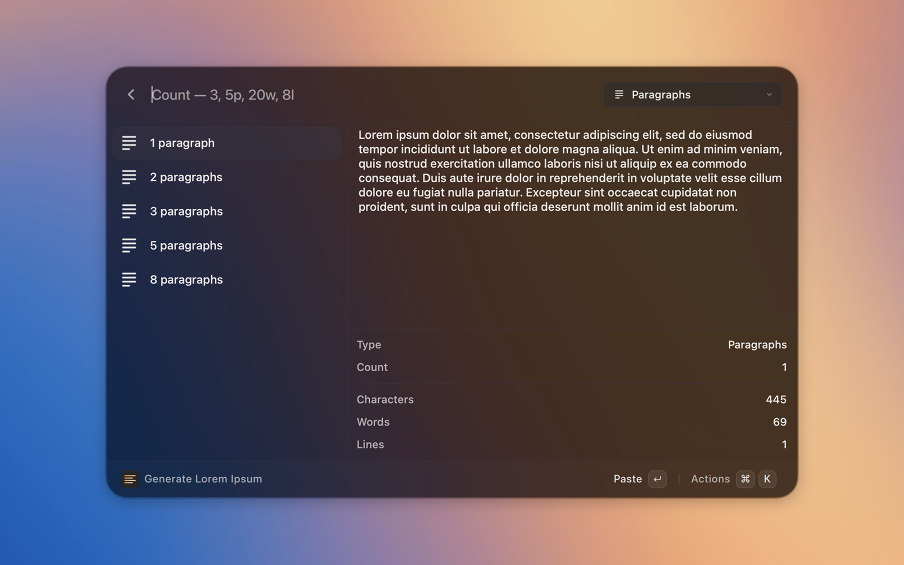

<p align="center">
  
</p>

# Lorem Ipsum

[](LICENSE)

Generate placeholder text from the launcher and paste it into the app you were just using.

Lorem Ipsum is a [Vicinae](https://vicinae.com) extension for Linux and macOS. Preview paragraphs, sentences, words, lists, or HTML, or generate them instantly from a no-view command.

## Screenshots



## Features

- Preview before you paste, with character, word, and line counts
- Instant no-view commands for paragraphs, sentences, words, and lists
- Type a count in the search bar (`3`, `5p`, `20w`, `8l`)
- Default action pastes into the frontmost app; copy or paste-and-copy remain available
- Classic *Lorem ipsum dolor sit amet…* opening, with a preference to turn it off

## Getting started

1. Run **Generate Lorem Ipsum**, pick a preset, and press Enter to paste.
2. Or run **Generate Paragraphs**, **Sentences**, **Words**, or **List** from root search for an instant paste.
3. Type a number in the preview search bar. Suffixes switch type: `p` paragraphs, `s` sentences, `w` words, `t` titles, `l` list, `h` HTML.

## Commands

- **Generate Lorem Ipsum** – Preview presets, then paste or copy
- **Generate Paragraphs** – Optional count, then paste immediately
- **Generate Sentences** – Same, for sentences
- **Generate Words** – Same, for words
- **Generate List** – Bullet list (defaults to 5 items)

## Preferences

- **Default Action** — paste into the frontmost app (default), copy, or both
- **Classic Opening** — start with *Lorem ipsum dolor sit amet…*

## Installation

Install and start [Vicinae](https://docs.vicinae.com/), then:

```bash
git clone https://github.com/TiageMiguel/loremipsum-vicinae.git
cd loremipsum-vicinae
npm install
npm run build
```

Use `npm run dev` while Vicinae is running if you are working on the extension.

See the [Vicinae extension docs](https://docs.vicinae.com/extensions/create) for more detail.

## Contributing

Open an issue or a pull request.
