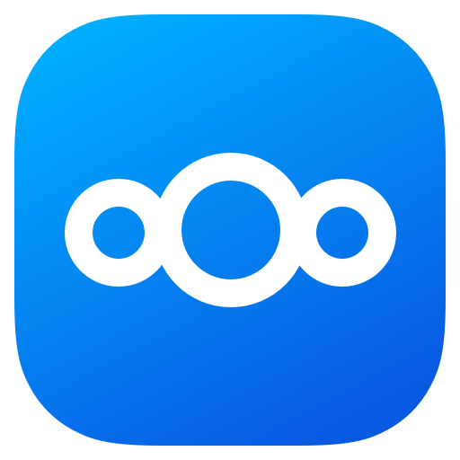

<p align="center">
    
</p>

# Nextcloud Vicinae Extension

A high-performance [Vicinae](https://github.com/vicinaehq/vicinae) extension for [Nextcloud](https://nextcloud.com/), enabling seamless file searches, favorite listings, deck cards inspection, notes preview, and activity tracking directly from your Linux launcher.

This extension has been rewritten and optimized to run natively using the `@vicinae/api` SDK, bypassing macOS dependencies and utilizing standard React and Node.js fetch mechanisms for robust operation.

---

## ✨ Features

- 🔍 **Search Files:** Search files and directories inside your Nextcloud instances using basic WebDAV filter queries.
- ⭐ **Favorites List:** View and jump straight to your favorited files and directories.
- 📋 **Nextcloud Deck:** Monitor your boards, lists (stacks), and cards, complete with due dates, tags, and overdue tracking.
- 📝 **Manage Notes:** Browse your text/markdown notes, view formatted details inside Vicinae, or edit directly in the browser.
- ⚡ **Activity Feed:** Track real-time events, file changes, calendar items, and collaborative activity with cursor-based pagination.

---

## ⚙️ Configuration

To start using the extension, fill in the launcher preferences:

1. **Hostname:** The address of your Nextcloud server (e.g., `cloud.example.com` or `https://mycloud.local`).
2. **Username:** Your Nextcloud username.
3. **App Password:** Log in to your Nextcloud instance web interface, navigate to **Settings > Security > Devices & sessions**, and click **Create new app password**. Copy the generated secret code and paste it into the Vicinae preference prompt.
4. **Search Scope (Optional):** Limit search commands to a specific subdirectory path (e.g., `Documents`). Leave blank to search all files.

---

## 🛠️ Local Development & Building

The extension uses the `vici` CLI tool provided by `@vicinae/api` to run and compile code.

### Prerequisites
Make sure you have Node.js (v18+) and npm installed.

### Installation
Install the project dependencies locally:
```bash
npm install
```

### Dev Mode
To run the extension in hot-reloading development mode:
```bash
npm run dev
```

### Build & Package
To check compilation errors and build a production-ready package:
```bash
npm run build
```
The compiled output directory will be generated inside:
`~/.local/share/vicinae/extensions/nextcloud-vicinae`

---

## 📄 License

This extension is licensed under the [MIT License](LICENSE).
