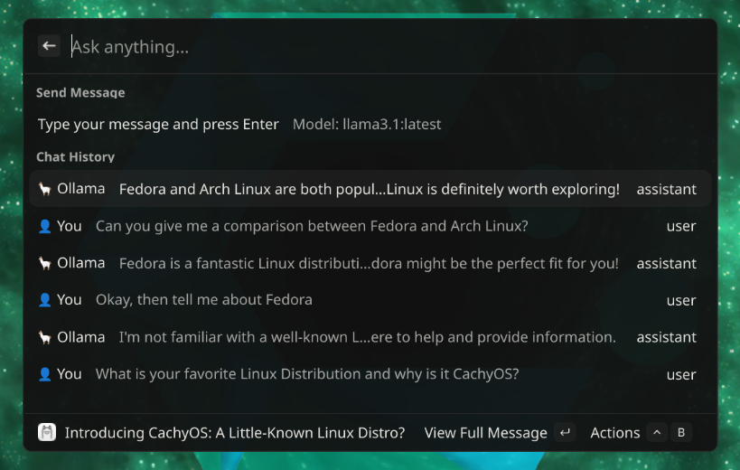
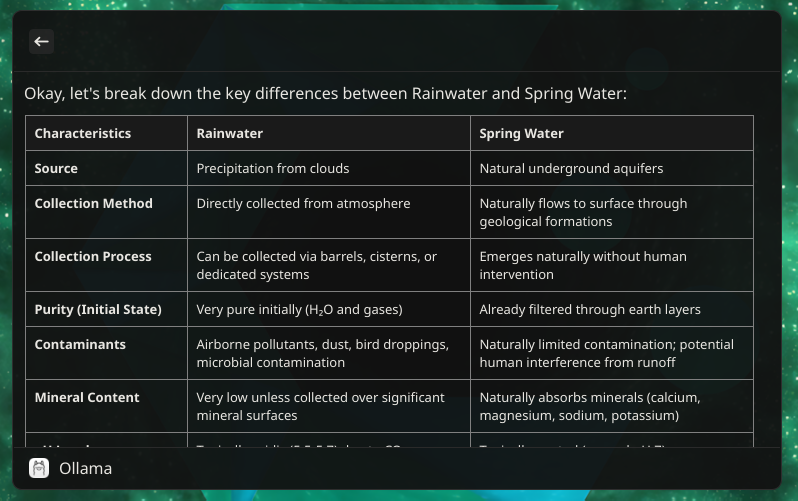
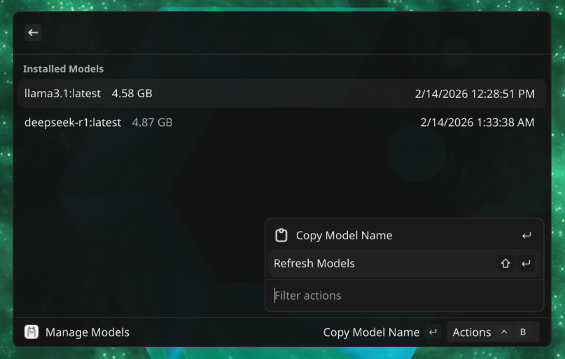
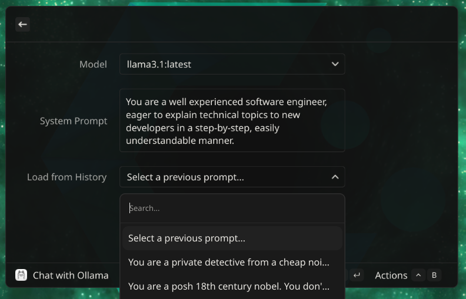
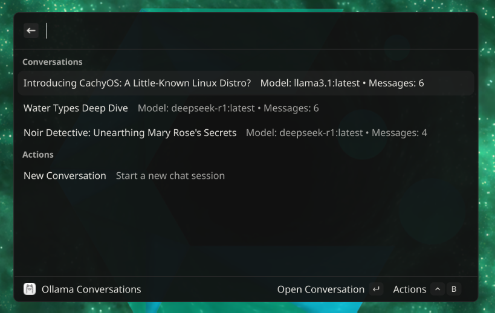

<div style="text-align: center">
  <h1>Vicinae Ollama</h1>
  
</div>

An extension for [Vicinae](https://github.com/vicinaehq/vicinae) enabling you to chat with Ollama AI models locally.

> **Note**: This is a Vicinae adaptation of the excellent Raycast Ollama extension. All credit for the original concept, design, and implementation goes to Massimiliano Pasquini. This adaptation simply ports the functionality to work with Vicinae.

## Description

This extension brings Ollama integration to Vicinae, allowing you to:
- Chat with local Ollama AI models
- Manage installed models
- Set system prompts for conversations
- Keep track of conversation history

## Requirements

- [Ollama](https://ollama.ai) installed and running on your system
- At least one model installed via Ollama CLI (e.g., `ollama pull llama2`)
- Vicinae installed on your system

## Installation

1. Clone this repository
2. Install dependencies with `npm install`
3. Run `npm run dev` for local development (auto-rebuild), or `npm run build` for a production build
4. Open Vicinae and look for the "Chat with Ollama" and "Manage Models" commands

> **Note**: The build scripts use `npx vici ...` under the hood so you do not need a global `vici` install.

## Usage

### Chat with Ollama
Start a conversation with your preferred Ollama model. The extension maintains chat history and context.



### Show message details
By default, Vicinae shows a truncated version of each message in the conversation. Use the "Show Details" action to view the full content of any message.



### Manage Models
View all installed Ollama models, see their sizes and last modified dates.



### Set conversation system prompt and model
Upon starting a new conversation, you can choose a system prompt and select which model to use for that conversation. You can also pick from a history of previously set system prompts to reuse them in new conversations.



### Keep a History of Conversations
The extension keeps a history of all conversations, allowing you to revisit past interactions.



## Development

```bash
npm install 
```

### Testing

This extension includes a comprehensive test suite. Run tests at any time:

```bash
# Run all tests once
npm test

# Run tests in watch mode (re-runs on file changes)
npm test -- --watch

# Generate coverage report
npm run test:coverage
```


### Project Organization

The extension is organized into focused, testable modules:

- **Hooks** (`src/hooks/`) - Custom React hooks for state management
- **Components** (`src/components/`) - UI components for different views
- **Utils** (`src/utils/`) - Shared logic and helper functions
- **Tests** (`src/**/__tests__/`) - Unit tests for all modules


## Credits and Attribution

This extension is a Vicinae adaptation of the [Raycast Ollama extension](https://github.com/raycast/extensions/tree/main/extensions/raycast-ollama).

**Original Work**:
- **Author**: Massimiliano Pasquini (massimiliano_pasquini)
- **Repository**: https://github.com/raycast/extensions/tree/main/extensions/raycast-ollama
- **License**: MIT

**This Vicinae Adaptation**:
- **Author**: Norman Steger (voodoods)
- **Repository**: https://github.com/voodoods/vicinae-ollama
- **License**: MIT (maintaining the same license as the original)

The original Raycast Ollama extension provided the foundation, architecture, and inspiration for this work. This adaptation changes the API layer from Raycast to Vicinae and extending its feature scope, while maintaining the core functionality and design principles.

## License

MIT License - see [LICENSE](https://opensource.org/license/mit) file for details.