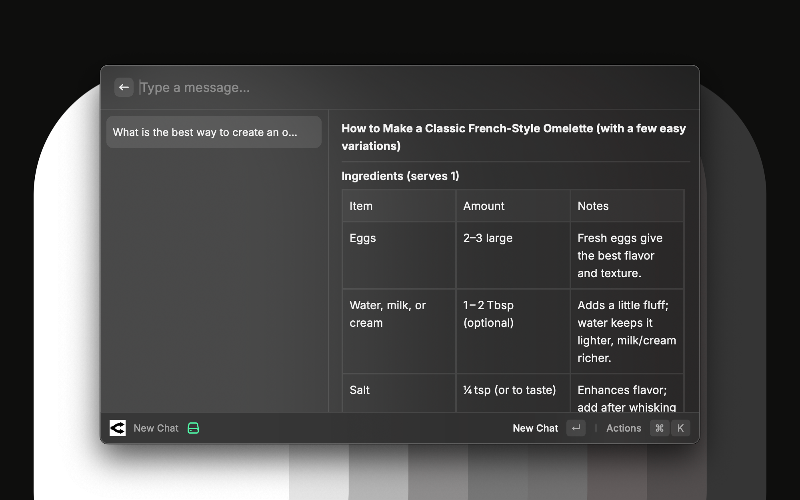
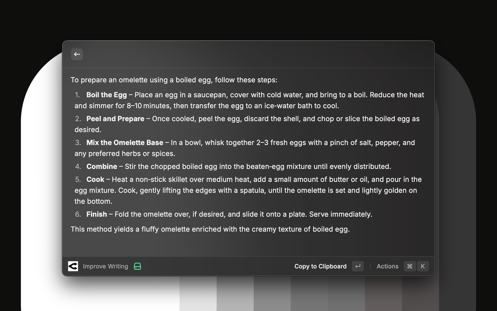
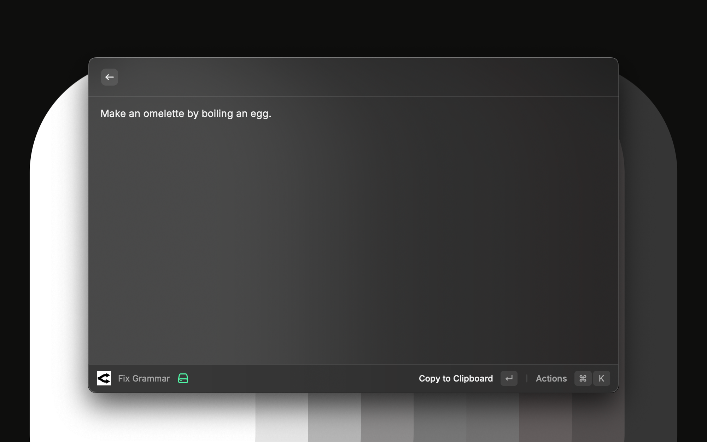

# Omelette for Vicinae

Access any AI model supported by OpenRouter directly within Vicinae. This extension provides a native interface for interacting with large language models like GPT-5.4, Claude Sonnet 4.6, and NVIDIA Nemotron 3 Super, featuring real-time streaming and local conversation persistence.

## Core Capabilities

- **Unified API Access**: Interact with models from OpenAI, Anthropic, Google, Meta, and Mistral through a single OpenRouter configuration.
- **Direct Model Switching**: Switch models instantly within the chat interface using the search bar dropdown—no need to go to settings.
- **Quick AI Actions**: Perform common AI tasks like summarizing, improving writing, or fixing grammar on selected text with a single command.
- **Low-Latency Streaming**: Responses are streamed word-by-word using the native Fetch API and ReadableStream for an interactive chat experience.
- **Local History**: Conversation data is stored securely on your machine via Vicinae's LocalStorage, enabling you to search and resume previous chats.
- **Keyboard-First Design**: Send messages, start new chats, and manage history using standard Vicinae shortcuts.

## Quick AI Actions

Transform your workflow with specialized commands that work on your currently selected text:

- **Summarize**: Get a concise summary of long articles or documents.
- **Improve Writing**: Make your emails and documents more professional and clear.
- **Fix Grammar**: Instantly correct spelling and grammatical errors.
- **Translate to English**: Quickly translate text from any language to English.
- **Custom Quick AI**: Run your own custom prompts on selected text.

## Configuration

### 1. API Key
Visit [OpenRouter Keys](https://openrouter.ai/keys) to generate an API key. 

### 2. Model ID
Enter the slug for the model you wish to use as your default. You can find the full list of supported models at [openrouter.ai/models](https://openrouter.ai/models). Popular options include:
- `anthropic/claude-sonnet-4.6`
- `openai/gpt-5.4`
- `nvidia/nemotron-3-nano-30b-a3b:free`
- `nvidia/nemotron-3-super-120b-a12b:free`

### 3. Setup Steps
1. Open the **New Chat** command in Vicinae.
2. If it is your first time, you will be prompted to enter your API key and default model ID.
3. Use the **Model Dropdown** in the search bar to switch between popular models on the fly.
4. Use **`Cmd + Shift + ,`** at any time to update your core preferences.

## Technical Details

- **Privacy**: No conversation data is sent to external servers other than OpenRouter.
- **Dependencies**: Built using the latest Vicinae API standards with minimal external dependencies.
- **Streaming**: Implements a robust buffer management system to handle JSON fragments in network packets.

---

*This extension is an independent client for OpenRouter and requires an OpenRouter account with sufficient credits (or use of free models).*
