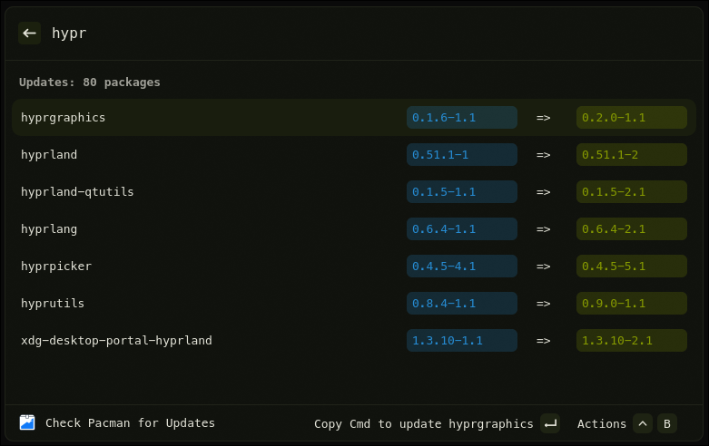
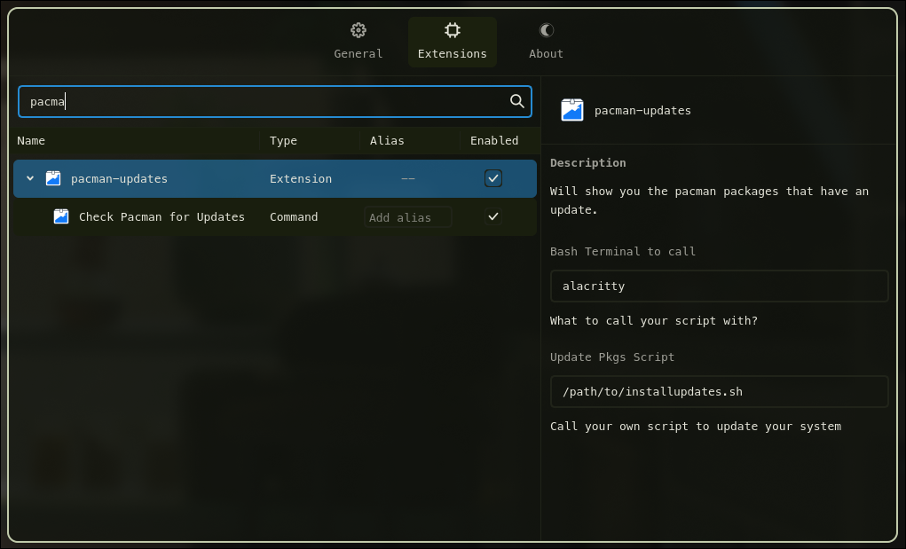
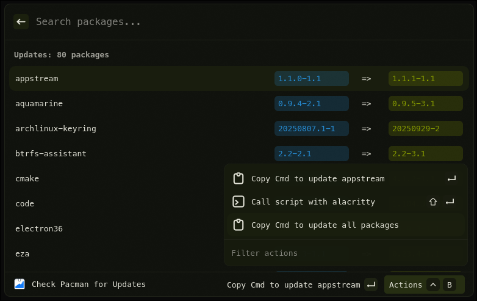

# Check Pacman Updates (Vicinae Extension)

See what packages are available for update using `pacman-contrib`.



## Features

- Display a list of packages available for update for arch based distributions.
- Set a bash terminal and script in the extension settings.
  - Use your own script to update your packages from the action menu!

## Requirements

- Linux with Hyprland
- [vicinae](https://github.com/vicinaehq/vicinae)
- [pacman-contrib](https://github.com/archlinux/pacman-contrib)

## Commands

- `Check Pacman for Updates` — Gets a list of packages available for update.

## Extension Preferences



 - Bash Terminal to call
   - Defaults: `unset`
 - Update Pkgs Script
   - Defaults: `unset`

## Quick start (development)

```bash
npm install
npm run dev
```

This starts the extension in Vicinae dev mode. Follow Vicinae’s docs for how to connect a dev extension if needed.

## Build (production)

```bash
npm run build
```

This produces a production bundle that can be distributed/installed per Vicinae guidelines.

## BYO Update Script

You can set the extension settings mentioned above and a new action will appear in the action menu that allows you to run your own script in a new bash terminal of your choosing.



## License

MIT
