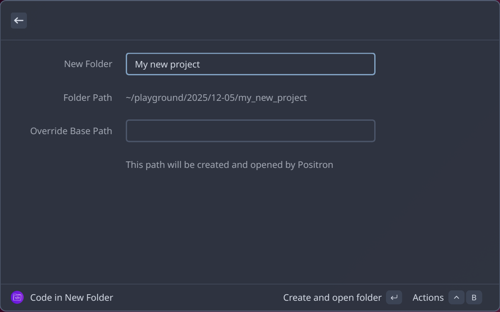
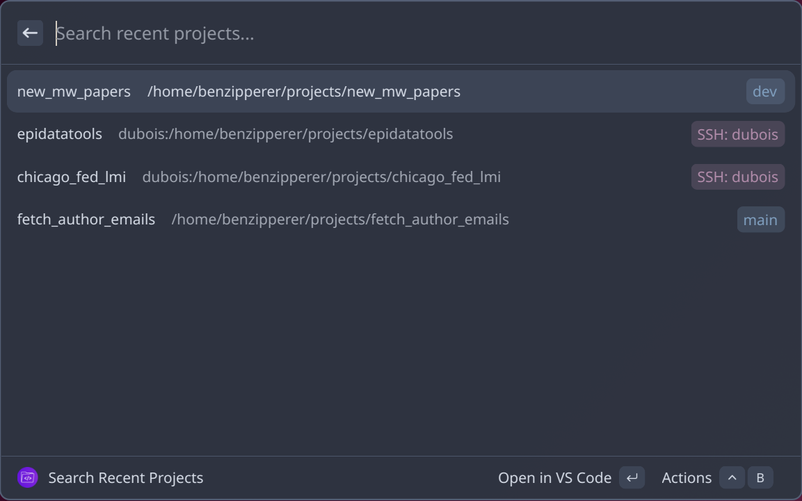

# Project Launcher

A Vicinae extension that helps you quickly create new projects or open existing ones in your preferred code editor.





## Features

### Code in New Folder
Create new project folders with a flexible, organized structure:
- Creates a flexible folder structure: `[BASE_PATH]/[YEAR]/[MM-DD]/[TITLE]`
  - Year and date are optional
- Configurable base path with flexible options:
  - Leave empty to use your home directory
  - Use `~/playground` for home-relative paths
  - Use absolute paths like `/` or `/projects` for specific locations
- Temporarily override the default base path if desired
- Configurable code editor (currently supports Positron, VS Code, and Cursor)

### Search Recent Projects
Quickly find and open your recent projects:
- Searches your editor's workspace history
- Displays recently accessed projects
- Opens projects directly in your preferred editor

## Usage

### Creating a New Project

1. Launch Vicinae and search for "Code in New Folder"
2. Enter your project title
3. Press Enter to create the folder and open it in your configured editor

### Opening Recent Projects

1. Launch Vicinae and search for "Search Recent Projects"
2. Browse or search through your recently accessed projects
3. Select a project to open it in your configured editor

## Configuration

You can customize your preferred editor and control how new project folders are created:

### Accessing Settings

1. Open Vicinae's settings window:
   - Search for and run "open settings" command, **OR**
   - Press **Ctrl + Comma** while Vicinae is active
2. Navigate to the **Extensions** tab
3. Find "Project Launcher" in the extensions list
4. Configure the settings:
   - **Preferred Editor**: Choose which editor to use (Positron, VS Code, or Cursor). This applies to both creating new projects and opening recent projects.
   - **Base Directory Path**: Where new folders will be created. Options:
     - Leave **empty** to use your home directory (default)
     - Use `~/playground` or `~/dev/experiments` for home-relative paths
     - Use absolute paths like `/projects` or `/` for specific locations
   - **Add Year to Path**: Include year subdirectory in path (default: enabled)
   - **Add Month-Day to Path**: Include month-day subdirectory in path (default: enabled)
   - **Sanitize Path Name**: Convert title to snake_case and remove special characters (default: enabled)
   - **Truncate Path Name**: Limit title to 50 characters or 10 words (default: enabled)

### Base Directory Path Examples

The extension supports multiple ways to specify where folders are created:

**Empty (default)**: Uses your home directory
- Display: `~/2025/01-15/my_project`
- Actual: `/home/username/2025/01-15/my_project`

**Tilde notation**: `~/playground`
- Display: `~/playground/2025/01-15/my_project`
- Actual: `/home/username/playground/2025/01-15/my_project`

**Absolute path**: `/projects`
- Display: `/projects/2025/01-15/my_project`
- Actual: `/projects/2025/01-15/my_project`

### Folder Structure Examples

The extension creates folders based on your settings. Here are some examples:

**All options enabled** (default):
```
[Your Base Path]/
  ├── 2025/
  │   ├── 01-15/
  │   │   └── my_project_name/
  │   └── 01-16/
  │       └── another_project/
  └── 2026/
      └── ...
```

**Year disabled, month-day enabled**:
```
[Your Base Path]/
  ├── 01-15/
  │   ├── my_project_name/
  │   └── another_project/
  └── 01-16/
      └── ...
```

**Both year and month-day disabled**:
```
[Your Base Path]/
  ├── my_project_name/
  ├── another_project/
  └── ...
```

**Sanitization**:
- With sanitization: `my_cool_project_2024`
- Without sanitization: `My Cool Project 2024!` (preserves original formatting)

## Requirements

- [Vicinae](https://docs.vicinae.com/) launcher
- Your preferred code editor installed and available in PATH (e.g., Positron, VS Code, Cursor)

## Inspiration

This extension is inspired by [Andrew Heiss's Raycast script](https://gist.github.com/andrewheiss/ef3ac7dfef2fdb8477a84e7e27f6853e) for creating dated project folders and the [Positron](https://github.com/raycast/extensions/tree/main/extensions/positron) and [VS Code](https://github.com/raycast/extensions/tree/main/extensions/visual-studio-code-recent-projects) raycast extensions.
