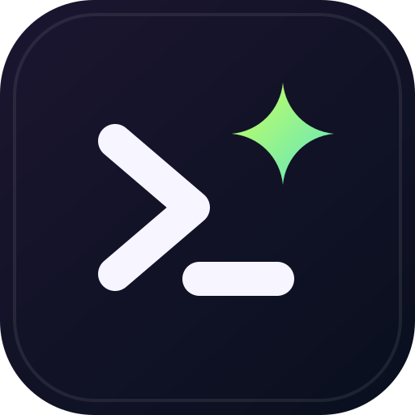
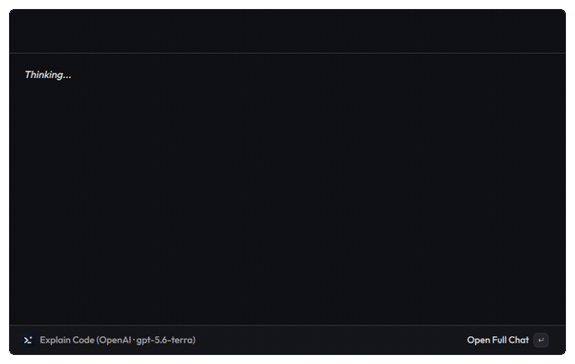
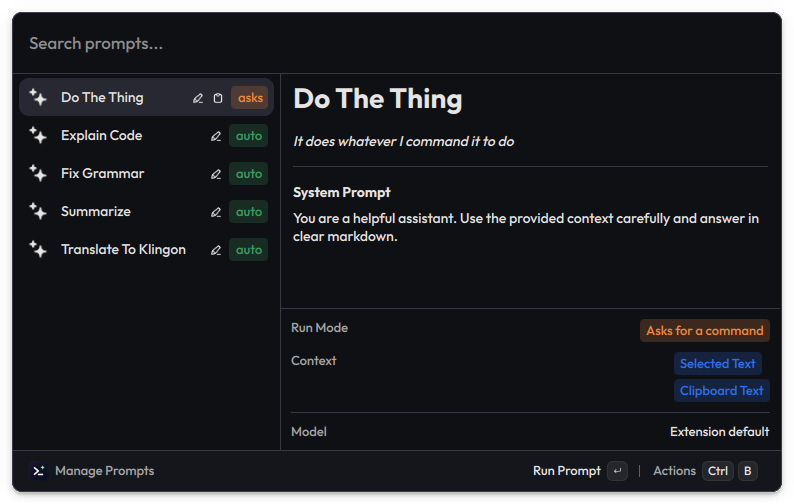
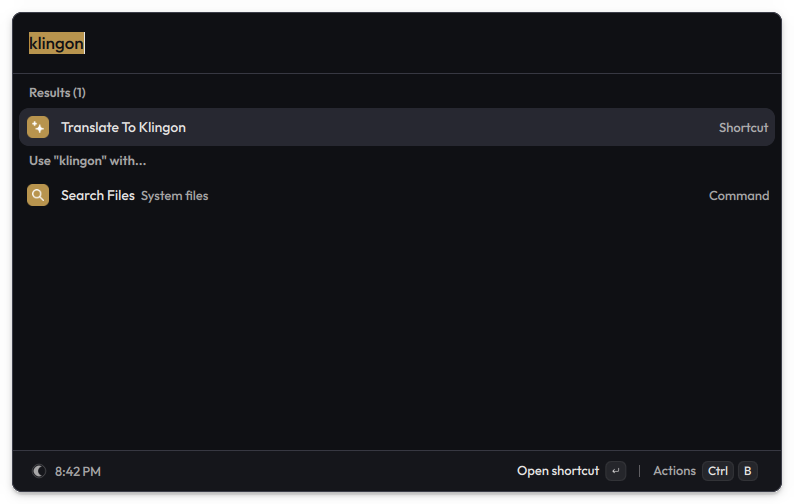

<p align="center">
  
</p>

<h1 align="center">PromptDeck</h1>

<p align="center">
  Reusable AI prompts, one keystroke away in the <a href="https://vicinae.com">Vicinae</a> launcher.
</p>

<p align="center">
  
</p>

Define a prompt once — system prompt, optional default command, and which context it should pick up — then run it against your selected text or clipboard from anywhere. Answers stream back as rendered markdown, so headings, lists and syntax-highlighted code all arrive formatted. Register a prompt as a Quicklink and it becomes its own entry in Vicinae's root search.

## Features

- **Reusable prompts** — name, system prompt, optional default command, and context sources (selected text, clipboard text). Prompts with a default command run instantly; leave it empty to be asked each time.
- **Root-search Quicklinks** — turn any prompt into a Vicinae Quicklink so it launches under its own name. A guided step after creating a prompt walks you through it.
- **Pick your context per run** — the command form previews each captured block with its character count, and lets you untick anything you don't want sent.
- **Streaming replies** — answers render live, and *Reply* continues the conversation with the same context pinned.
- **Paste straight back** — a prompt can send its answer to the app you were working in, so selecting text and firing a prompt rewrites it in place.
- **Three providers, separate keys** — OpenAI, Anthropic, and Google. Each prompt can override the provider, model, temperature, reasoning level, and max output tokens.
- **OpenAI-compatible endpoints** — point the base URL at Ollama, OpenRouter, or any compatible server; local ones work without an API key.
- **Local history** — browse, re-run, and copy past runs, or turn history off entirely.

## Setup

1. Open the extension preferences.
2. Pick a **Default Provider** and paste its API key — you only need keys for the providers you actually use:
   - [OpenAI](https://platform.openai.com/api-keys)
   - [Anthropic](https://console.anthropic.com/settings/keys)
   - [Google AI Studio](https://aistudio.google.com/apikey)
3. Set a **Default Model** for that provider, e.g. `gpt-4o-mini`, `claude-sonnet-4-5`, or `gemini-2.5-flash`.

For a local or alternative OpenAI-compatible server, choose **OpenAI or Compatible** as the provider and set the **OpenAI-Compatible Base URL** — for example `http://localhost:11434/v1` for Ollama, with the model set to whatever you have pulled. Local servers that take no auth need no API key; hosted ones such as OpenRouter still need theirs.

## Usage

**Create a prompt.** Open **Manage Prompts** → *Create Prompt*. Give it a name and a system prompt, choose whether it should read your selected text and/or clipboard, and optionally set a default command. Typing a name that matches nothing in the search bar also offers to create it.

<p align="center">
  
</p>

Each prompt shows how it runs at a glance — a green `auto` tag for prompts with a default command, orange `asks` for those that prompt you — alongside icons for the context it captures.

**Add it to root search.** After saving, the guided step opens Vicinae's Quicklink form prefilled — keep the link and *Open With* as they are, adjust the name or icon if you like, and save. You can also do this later via *Create Quicklink* on any prompt. The prompt then answers to its own name in root search:

<p align="center">
  
</p>

**Run it.** Launch the Quicklink, or run it straight from **Manage Prompts**. Prompts without a default command ask what to do and show what context was captured. When the answer arrives, *Copy* grabs it (optionally closing the launcher) and *Reply* keeps the conversation going.

**Review.** **Prompt History** lists past runs grouped by prompt, with copy, re-run, and delete.

## Preferences

| Preference | Description |
| --- | --- |
| Default Provider | Provider used unless a prompt overrides it. |
| OpenAI / Anthropic / Google API Key | Stored as Vicinae password preferences. The OpenAI one can be left blank for local endpoints that need no auth. |
| Default Model | Model id for the default provider. |
| OpenAI-Compatible Base URL | Optional endpoint override (OpenAI provider only). |
| Temperature | Optional default; values outside the active provider's range are ignored. |
| Reasoning Level | Optional default reasoning effort, passed to the provider as-is. Commonly `minimal` to `max`; support varies by provider and model. |
| Max Output Tokens | Optional default output cap. |
| Save prompt run history | Turn local run history on or off. |

Every prompt can override the provider, model, temperature, reasoning level, and max output tokens individually.

## Privacy

- Running a prompt sends the prompt text — plus your **selected text** and/or **clipboard text** when the prompt includes them — to the LLM provider you configured. The extension makes no other network requests.
- API keys are stored as Vicinae password preferences and are only ever sent to the provider they belong to.
- Run history stays on your machine. Clear it any time from **Prompt History**, or disable it with the **Save prompt run history** preference.

## Development

```sh
npm ci
npx vici develop
```
