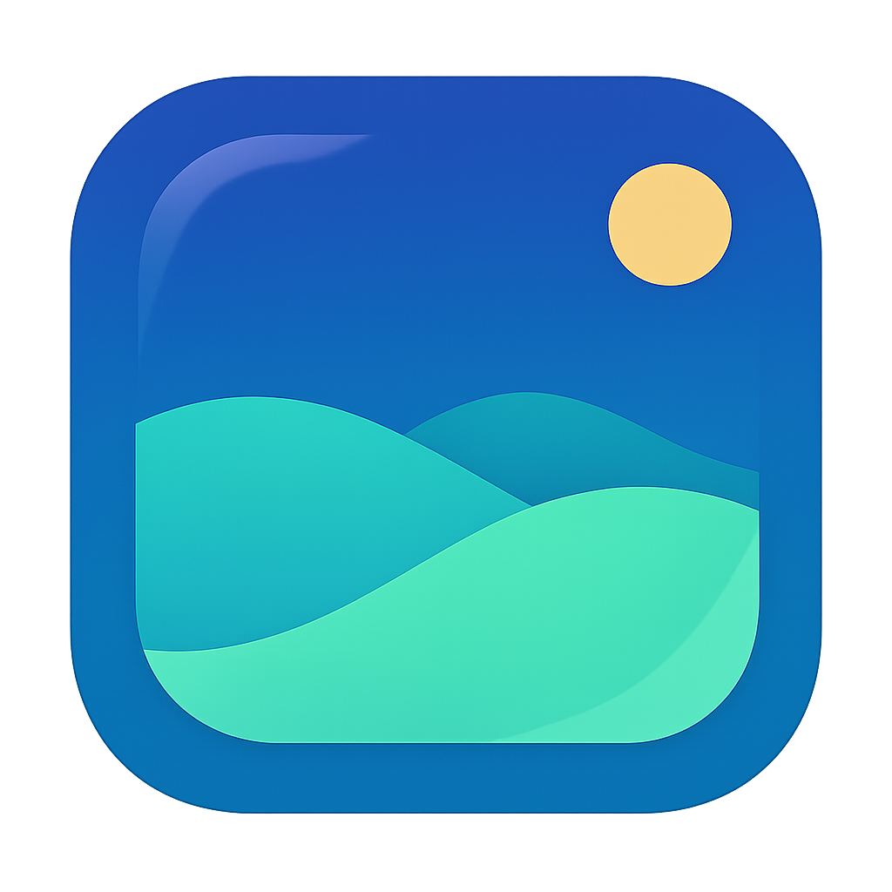
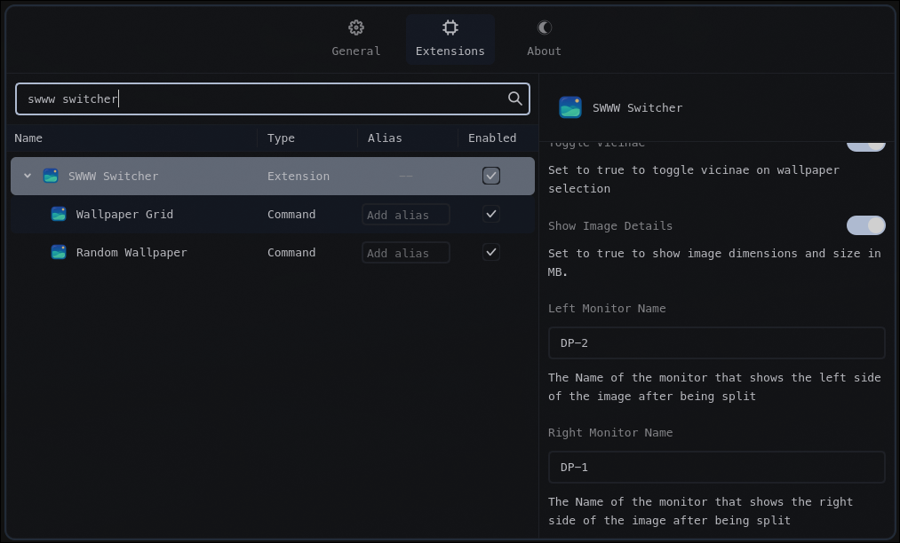
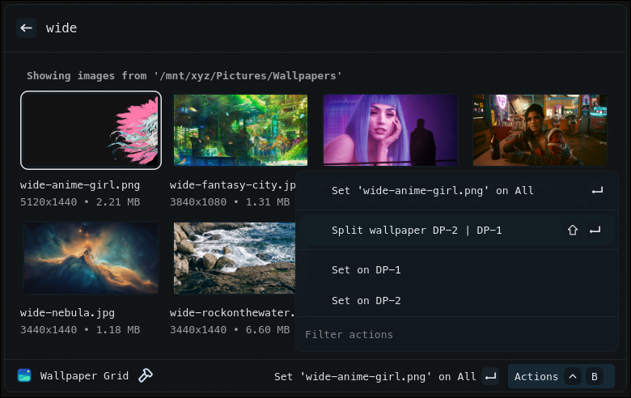

# SWWW Switcher (Vicinae Extension)

Pick a wallpaper from a grid and apply with swww with a transition of your choosing. You can even generate a color palette from the wallpaper!

Dont feel like picking a wallpaper? Just run Random Wallpaper!


## Features

- Choose a path in extension settings
- Grid layout of images in the path
- One-tap to set wallpaper via `swww` on all or a single monitor
  - Split one images into multiple wallpapers with ImageMagick
- Add a sweet swww transition, configure the duration and steps too
- Add a color generator to run on the image
- Use Imagemagick to blur, grayscale, negate the selected image for a lock screen, etc...
- Set a random wallpaper.

## Requirements

- Linux with Hyprland
- [vicinae](https://github.com/vicinaehq/vicinae) v0.12.2 or higher
- [swww](https://github.com/LGFae/swww)
- Images in one of: jpg, jpeg, png, webp, gif
- Optional: Color generator like [matugen](https://github.com/InioX/matugen)
- Optional: ImageMagick for splitting one image in half for two wallpapers or for post processing like blur

## Commands

- `Wallpaper grid` — Open the wallpaper browser and set a wallpaper
- `Random Wallpaper` — Randomly apply a wallpaper

## Extension Preferences


 - Wallpaper Path
 - SWWW Transition Type
    - Default = `random`
 - SWWW Duration (In seconds)
    - Default = `3`
 - SWWW Transition Step
   - Default = `90`
 - Color Generator
   - Default = `none`
 - Grid Rows
   - Default = `4`
 - Toggle Vicinae on Selection
   - Default = `true`
 - Show Image Details
   - Default = `true`
 - ImageMagick Post-Production
   - Default = `none`
 - leftmonitor
   - Default = `unset`
 - rightmonitor
   - Default = `unset`

## Quick start (development)

```bash
npm install
npm run dev
```

This starts the extension in Vicinae dev mode. Follow Vicinae’s docs for how to connect a dev extension if needed.

## Build (production)

```bash
npm run build
```

This produces a production bundle that can be distributed/installed per Vicinae guidelines.

## First Usage
1. Launch `wallpaper grid`

2. Set the path to your images.

3. Search or scroll for that perfect image, then choose “Set” to apply it to all monitors. Go into the menu to apply it to only one monitor.

4. Change extension settings to suit your needs.

### Add this extension to your Hyprland config

This is how I have added this extension to my keybindings file:

```
bind = SUPER CTRL, W, exec, vicinae vicinae://extensions/sovereign/swww-switcher/wpgrid
bind = SUPER SHIFT, W, exec, vicinae vicinae://extensions/sovereign/swww-switcher/wprandom
```

## SWWW Transitions

The folowing tranistions are supported:

  - Simple
  - Fade
  - Left
  - Right
  - Top
  - Bottom
  - Wipe
  - Wave
  - Grow
  - Center
  - Any
  - Outer
  - <span style="color: red;">R</span><span style="color: orange;">a</span><span style="color: yellow;">n</span><span style="color: green;">d</span><span style="color: blue;">o</span><span style="color: indigo;">m</span>

## SWWW Steps and Duration

You can select the duration in seconds using the `SWWW Duration (In seconds)` dropdown in the extension preferences. You can select 1,2,3,5 and 8 seconds.

You can select the step using the `SWWW Transition Step` dropdown in the extension preferences. You have as fast as instant and the slowest possible.

## Color Generator:

Use a tool to pull colors out of a wallpaper for themeing purposes. Below is a list of tools supported:

- [Matugen](https://github.com/matgen/matgen)
- [Pywal](https://github.com/dylanaraps/pywal)
- [Wpgtk](https://github.com/deviantfero/wpgtk)
- [Schemer2](https://github.com/thefryscorer/schemer2)
- [Colorz](https://github.com/metakirby5/colorz)
- [Haishoku](https://github.com/LanceGin/haishoku)
- [Wallust](https://codeberg.org/explosion-mental/wallust)

### I use Matugen, BTW

- Color generator tools like [Matugen](https://github.com/matgen/matgen) will need to be set up independently of this Extension. I will provide my matugen files to get you started.

Base of this theme provided by the amazing [Sridou](https://github.com/Sridou). Check the [offical documentation](https://docs.vicinae.com/theming/matugen) for more!

1. Save a template file where ever you'd like. Example below.
```
# Vicinae Matugen Theme for swww switcher

[meta]
name = "Matugen"
description = "Changes color when the wallpaper does. It's a follower. {{mode}} variant"
variant = "{{mode}}"
icon = "icons/matugen.png"

# ============================================================================
# Core Colors
# ============================================================================

[colors.core]
accent = "{{colors.primary.default.hex}}"
accent_foreground = "{{colors.background.default.hex}}"
background = "{{colors.background.default.hex}}"
foreground = "{{colors.on_background.default.hex}}"
secondary_background = "{{colors.surface_container_low.default.hex}}"
border = "{{colors.outline_variant.default.hex}}"

# ============================================================================
# Window-Specific Colors
# ============================================================================

[colors.main_window]
border = "{{colors.outline_variant.default.hex}}"

[colors.settings_window]
border = "{{colors.outline.default.hex}}"

# ============================================================================
# Accent Colors
# ============================================================================

[colors.accents]
blue = "{{colors.primary.default.hex}}"
green = "{{colors.tertiary.default.hex}}"
magenta = "{{colors.secondary.default.hex}}"
orange = "{{colors.error.default.hex}}"
red = "{{colors.error.default.hex}}"
yellow = "{{colors.tertiary.default.hex}}"
cyan = "{{colors.primary.default.hex}}"
purple = "{{colors.secondary.default.hex}}"

# ============================================================================
# Text Colors
# ============================================================================

[colors.text]
default = "{{colors.on_surface.default.hex}}"
muted = "{{colors.on_surface_variant.default.hex}}"
danger = "{{colors.error.default.hex}}"
success = "{{colors.tertiary.default.hex}}"
placeholder = "{{colors.on_surface_variant.default.hex}}"

[colors.text.selection]
background = "{{colors.primary.default.hex}}"
foreground = "{{colors.on_primary.default.hex}}"

[colors.text.links]
default = "{{colors.primary.default.hex}}"
visited = "{{colors.secondary.default.hex}}"

# ============================================================================
# Input Fields
# ============================================================================

[colors.input]
border = "{{colors.outline.default.hex}}"
border_focus = "{{colors.primary.default.hex}}"
border_error = "{{colors.error.default.hex}}"

# ============================================================================
# Buttons
# ============================================================================

[colors.button.primary]
background = "{{colors.on_secondary.default.hex}}"
foreground = "{{colors.background.default.hex}}"

[colors.button.primary.hover]
background = { name = "{{colors.surface_container_highest.default.hex}}", opacity = 0.85 }

[colors.button.primary.focus]
outline = "colors.core.accent"

# ============================================================================
# Lists
# ============================================================================

[colors.list.item.hover]
background = { name = "{{colors.on_secondary.default.hex}}", opacity = 0.25  }
foreground = "{{colors.background.default.hex}}"

[colors.list.item.selection]
background = { name = "{{colors.on_primary_container.default.hex}}", opacity = 0.5 }
foreground = "{{colors.background.default.hex}}"
secondary_background = "{{colors.on_secondary.default.hex}}"
secondary_foreground = "{{colors.background.default.hex}}"

# ============================================================================
# Grid Items
# ============================================================================

[colors.grid.item]
background = "{{colors.background.default.hex}}"

[colors.grid.item.hover]
outline = { name = "{{colors.primary.default.hex}}", opacity = 0.6 }

[colors.grid.item.selection]
outline = { name = "{{colors.primary.default.hex}}", opacity = 0.9 }

# ============================================================================
# Scrollbars
# ============================================================================

[colors.scrollbars]
background = { name = "{{colors.on_surface.default.hex}}", opacity = 0.2 }

# ============================================================================
# Loading Indicators
# ============================================================================

[colors.loading]
bar = "{{colors.primary.default.hex}}"
spinner = "{{colors.primary.default.hex}}"

```

2. Call Template File from the matugen config.toml

```
[templates.vicinae]
input_path = '~/.config/matugen/templates/vicinae.toml'
output_path = '~/.local/share/vicinae/themes/matugen.toml'
post_hook = 'vicinae theme set matugen'
```
3. Note the post hook. That's how you get Vicinae to apply the new theme.

## Split One Wallpaper for Two Monitors

- If you set `Left Monitor Name` and `Right Monitor Name` in the extension preferences, you can split the image in half.
  - The names must be present in the `hyprctl monitors -j` array for the action to appear.





### Did you know?

Random Wallpaper can apply one image to multiple monitors if you set `Left Monitor Name` and `Right Monitor Name` in the extension preferences, and the ratio betwen the width and height of the image is greater then 1.8!

## ImageMagick Post-Production

If you want to use ImageMagick to 'post-process' your selected image, like blur, black and white, or negate then select from the prebuilts under `ImageMagick Post-Production` in the extension preferences dropdown menu!

- Gray Scale
- Gray Scale + Blur
- Gray Scale + Heavy Blur
- Blur
- Blur + Darken
- Heavy Blur
- Heavy Blur + Darken
- Negate

This will save the processed image to  `~/.cache/vicinae/swww-switcher/postprod.jpg` which you can use as a wallpaper for rofi, lock screen, login screen, etc...

## Post Commands

If you want to run a command or even a script after setting a new wallpaper, you can use the `Post Command` option in the extension preferences dropdown menu! Add the placeholder `${wallpaper}` and it will replace it with the path to the new wallpaper!

- Example: `notify-send "Wallpaper changed to ${wallpaper}"`

## License

MIT

## Thank you

1. I took code from [lmm1ng](https://github.com/lmm1ng/hyprpaper_switcher_ext) and [schromp](https://github.com/schromp/vicinae-extensions/tree/main/swww) for this project. They helped me learn how to make an extension for Vicinae. Thank you!

2. Shout out to [RodsonMatos](https://github.com/RodsonMatos) for adding wallust support to the Extension! Thank you!
