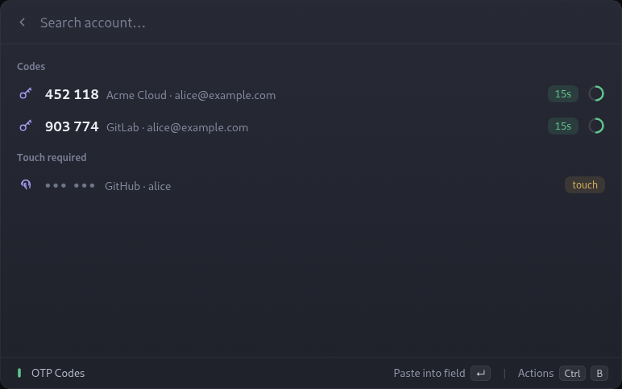
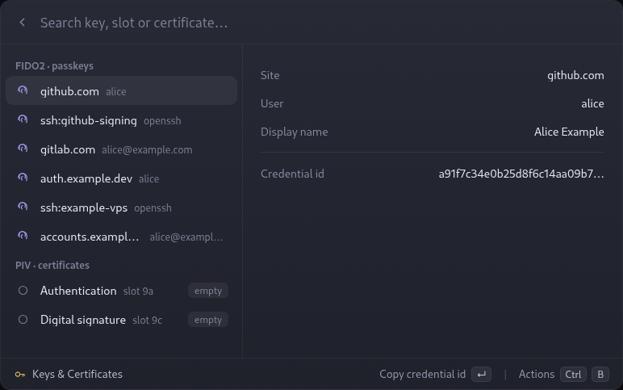

<p align="center">
  
</p>

<h1 align="center">YubiKey for Vicinae</h1>

<p align="center">
  Use your YubiKey from <a href="https://github.com/vicinaehq/vicinae">Vicinae</a>:
  TOTP codes, FIDO2 passkeys and PIV certificates, with no external dependencies.
</p>

---

This extension speaks every YubiKey protocol **natively** in TypeScript. It does not
need `ykman`, `yubikit`, Python or any native addon — only a running `pcscd` (present
on virtually every Linux desktop), plus the standard FIDO udev rule for the passkey
screen. See [docs/architecture.md](docs/architecture.md) for why and how.

<p align="center">OTP Codes command:</p>
<p align="center">
  
</p>

<p align="center">Keys &amp; Certificates command:</p>
<p align="center">
  
</p>

## Commands

### YubiKey: OTP Codes

Lists the TOTP codes stored on the key, with a live countdown ring per account. The
primary action pastes the selected code into whatever field was focused — like
Vicinae's own clipboard paste. Accounts that require a touch don't paste immediately:
they ask for the touch and paste once the key confirms it.

If the OATH application has a password, the access key is read from the system
keyring (imported from `ykman`'s keystore when present), so you usually never see a
password prompt.

### YubiKey: Keys & Certificates

- **FIDO2 passkeys** — enumerate resident credentials (site, user, credential id),
  copy an id, or delete a passkey (with a type-to-confirm guard).
- **PIV** — view the certificate in each slot (subject, issuer, validity, serial) and
  export it as PEM.

The PIN is asked in-app and kept only in memory for the duration of the command —
never on disk, never in a process argument.

## Language

The interface is available in **English** and **Portuguese**. Set it in the
extension preferences (`Language`): *Automatic* follows the system locale, or pick
one explicitly.

## Requirements

- Linux with `pcscd` running:
  ```bash
  # Fedora / Arch / openSUSE: package "pcsc-lite"; Debian / Ubuntu: "pcscd"
  sudo systemctl enable --now pcscd.socket
  ```
- The `ccid` driver (usually pulled in by `pcsc-lite` / `pcscd`).
- For the passkey screen, the FIDO udev rule: `libfido2` (Fedora/Arch) or
  `libu2f-udev` (Debian/Ubuntu).

> If you use `gpg-agent` / `scdaemon`, add `pcsc-shared` to `~/.gnupg/scdaemon.conf`
> so it does not hold the reader exclusively.

## Installation

```bash
git clone https://github.com/LLawli/YubiKey-vicinae.git
cd YubiKey-vicinae
npm install
npm run build
```

The build places the extension in Vicinae's extension folder automatically. Restart
the Vicinae server if it doesn't appear.

## Development

```bash
npm install
npm run dev     # vici develop, with live reload; the command shows a (Dev) suffix
```

For a production bundle:

```bash
npm run build
```

## Documentation

- [Architecture](docs/architecture.md) — the design and the security posture.
- [Decisions](docs/decisions.md) — why each choice was made.
- [Protocols](docs/protocols.md) — byte-level implementation notes.

## License

MIT. See [LICENSE](LICENSE).
